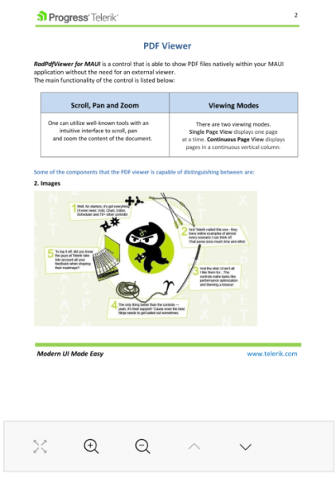

# PDF Viewer Toolbar

The PDF Viewer Toolbar includes some of the commands that the PDF Viewer provides. You also have the option to include additional toolbar items in the `PdfViewerToolbar` through a custom command.  

## Predefined Toolbar Items

By default, the PDF Viewer Toolbar provides the following toolbar items described in the table below:

|Toolbar Item| Description |
|--------|-------|
| `PdfViewerZoomInToolbarItem` | Executes the `PdfViewerZoomInCommand` |
| `PdfViewerZoomOutToolbarItem` | Executes the `PdfViewerZoomOutCommand` |
| `PdfViewerNavigateToNextPageToolbarItem` | Executes the `PdfViewerNavigateToPreviousPageCommand` |
| `PdfViewerNavigateToPreviousPageToolbarItem` | Executes the `PdfViewerNavigateToNextPageCommand` |
| `PdfViewerFitToWidthToolbarItem` | Executes the `PdfViewerFitDocumentToWidthCommand` |
| `PdfViewerNavigateToPageToolbarItem` | Executes the `PdfViewerNavigateToPreviousPageCommand` |
| `PdfViewerToggleLayoutModeToolbarItem` | toggles the `RadPdfViewer.LayoutMode` property between `SinglePage` and `ContinuousScroll` |
| `PdfViewerSearchToolbarItem` | Activates the search functionality in the PDF viewer control. Opens a popup. |
| `PdfViewerSearchNavigationToolbarItem` | Activates the search functionality in the PDF viewer control. Creates a default set of toolbar items applicabe for search feature |

>note `PdfToolbarItems` inherit from `ButtonToolbarItem` except `PdfViewerNavigateToPageToolbarItem`.

All properties applicable for `ToolbarItem` are available for the PDF Viewer `PdfViewerNavigateToPageToolbarItem`. 
All properties applicable for `ButtonToolbarItem` are available for all PDF Viewer toolbar items except `PdfViewerNavigateToPageToolbarItem`.

The following example demonstrates how to use the Toolbar and its predefined items:

**1.** Use the following snippet to define the `RadPdfViewer` and `RadPdfToolbar`:

<snippet id='pdfviewer-toolbar-xaml'/>

**2.** Add the following namespace:

```XAML
xmlns:telerik="http://schemas.telerik.com/2022/xaml/maui"
```

**3.** Then add the following code to visualize the PDF document:

<snippet id='pdfviewer-toolbar'/>

>The snippet above shows one of the approaches for loading a PDF document inside `RadPdfViewer` just for the purpose of the example.

The following image shows the results from the completed example:



> For a runnalbe example with the PDF Viewer toolbar, see the [SDKBrowser Demo Application]() and go to **PdfViewer > Toolbar**.

## Custom Toolbar Items

You can add custom toolbar items to the PDF Toolbar and bind them to a custom command. You can achieve this by using the `ButtonToolbarItem`.

Here is an example showing how to add a custom Toolbar item with a sample command bound to it. The command is used just to display a message with the PDF document's file size.

**1.** Add the PdfViewer and the PdfToolbar controls to your page:

<snippet id='pdfviewer-toolbar-customcommand-xaml' />

**2.** Load a sample PDF document in code-behind:

<snippet id='pdfviewer-toolbar-customcommand' />

**3.** Add the ViewModel class. In the ViewModel, get a reference to the `RadFixedDocument` instance through the `Document` property of the PDF Viewer and execute the `DisplayFileSizeCommand` bound to the `Command` property of the custom Toolbar item:

<snippet id='pdfviewer-toolbar-customcommand-vm' />

The image below shows the results on the different platforms:


> For a runnable example demonstrating the PDF Viewer's custom Toolbar items, see the [SDKBrowser Demo Application]() and go to **PdfViewer > Toolbar**.

## See Also

- [Review PDF Viewer Commands]()
