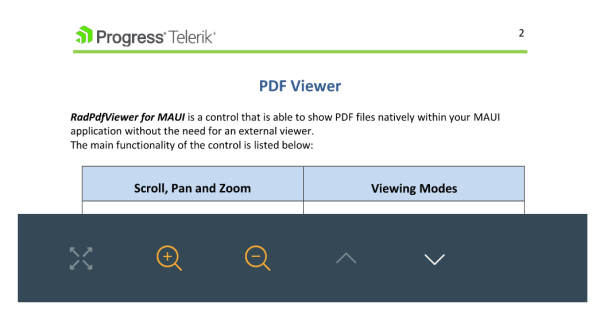

# .NET MAUI PDF Viewer Toolbar Styling

The PDF Viewer for .NET MAUI provides a flexible styling API for its toolbar items. 

As the `PDFViewerToolbar` is based on the `RadToolbar` control, all toolbar items in the PDF Viewer inherit from `ButtonToolbarItem`. All styling properties available for the `ButtonToolbarItem` are also applicable for the PDF toolbar items. 

Here is an example:

**1.** PDF Viewer and Toolbar definitions in XAML:

<snippet id='pdfviewer-toolbar-styling-xaml'/>

**2.** Add the following namespace:

```XAML
xmlns:telerik="http://schemas.telerik.com/2022/xaml/maui"
```

**3.**: Define the style in the page's resources:

```XAML
<Style TargetType="telerik:ButtonToolbarItemView" x:Key="commonStyle">
    <Setter Property="MinimumWidthRequest" Value="40"/>
    <Setter Property="BackgroundColor" Value="#608660C5"/>
</Style>

<Style TargetType="telerik:ButtonToolbarItemView" x:Key="zoomToolbarStyle" BasedOn="{StaticResource commonStyle}">
    <Setter Property="BorderBrush" Value="LightGray"/>
    <Setter Property="CornerRadius" Value="5"/>
    <Setter Property="BorderThickness" Value="2"/>
</Style>
```

**4.**: Pass the document to the `PdfViewer.Source`:

<snippet id='pdfviewer-toolbar'/>

Here is the result on the image below:



## See Also

- [RadPdfProcessing library](https://docs.telerik.com/devtools/document-processing/libraries/radpdfprocessing/overview)
