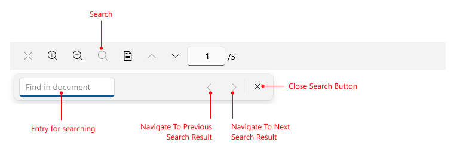
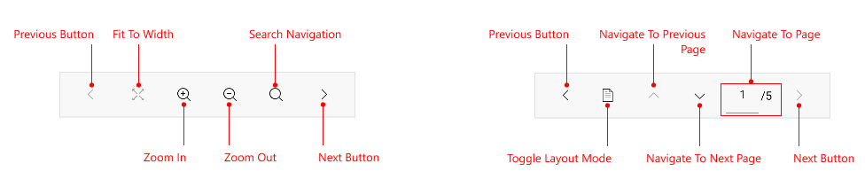

# .NET MAUI PDF Viewer Toolbar Visual Structure

The visual structure of the .NET MAUI PDF Viewer represents the anatomy of the UI component. Being familiar with the visual elements of the PDF Viewer allows you to quickly find the information required to configure them.

The images in this article show the anatomy of the <ComponentName> and its building blocks.

## PDF Viewer Toolbar Desktop Structure

## PDF Viewer Toolbar Mobile Structure

## See Also

- [Review all Available Commands]()
- [PDF Viewer Toolbar]()
