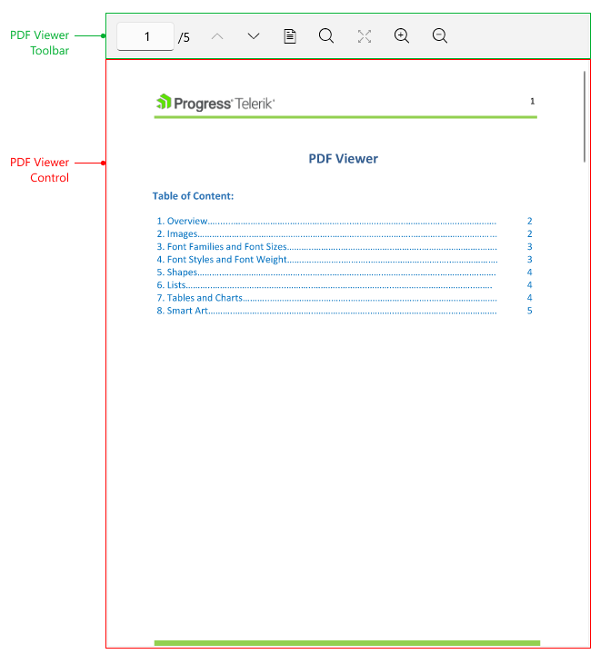

# .NET MAUI PDF Viewer Visual Structure

The visual structure of the .NET MAUI PDF Viewer represents the anatomy of the UI component. Being familiar with the visual elements of the PDF Viewer allows you to quickly find the information required to configure them.

## Displayed Elements

* **PDF Viewer Control**&mdash;The area where the PDF document is visualized.
* **PDF Viewer Toolbar**&mdash;Represents a toolbar with [built-in toolbar items]() which execute the commands that the PDF Viewer provides.

## See Also

- [Review all Available Commands]()
- [PDF Viewer Toolbar]()
