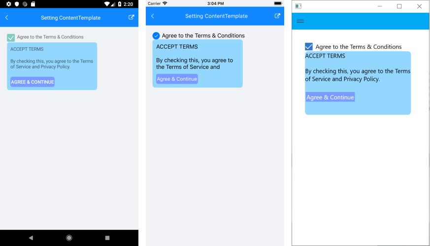

# .NET MAUI Popup Content

The Popup provides options for setting its content and for defining when it will open and close.

## Opening and Closing

To show the Popup control, set `IsOpen` property to `True`. By default, the Popup stays open until the `IsOpen` property is set to `False` or, in case of a non-modal Popup, until the user clicks outside the control.

## Setting the Content

To host content inside the Popup, either add it directly as a child element or use the `ContentTemplate` Popup property.

The example below demonstrates how to create a sample `DataTemplate` and set it as the `ContentTemplate` of the Popup.

1. Add the needed `DataTemplate` to the page Resources:

 <snippet id='popup-features-contenttemplate-resource' />

1. When you define the Popup either in XAML or as code-behind, apply the `ContentTemplate` property:

 <snippet id='popup-features-contenttemplate-xaml' />

1. Add the events as shown below:

 <snippet id='popup-features-contenttemplate-events' />

The following image shows the end result.

## See Also

- [Modal Popup]()
