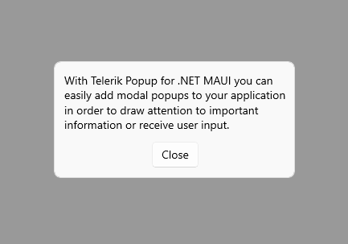

# .NET MAUI Modal Popup

You can define whether the [.NET MAUI Popup]() will be modal or not through the `IsModal` Boolean property. In both cases, the UI behind the popup gets inactive and cannot be used until the popup is closed. For non-modal popups, however, you can focus the content behind by clicking outside the popup, thus closing it.

Here is an example of a modal popup attached to the `ContentPage`:

<snippet id='popup-features-modal' />

And the next example shows the event handlers for opening/closing the popup:

<snippet id='popup-features-modal-events' />

Here is the result&mdash;the Popup applies the default outside background color for the content behind:

## See Also

- [Popup Content]()
- [Styling]()