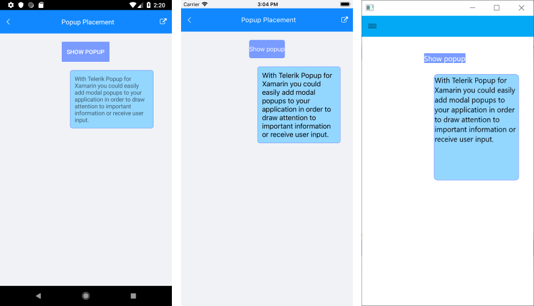

# .NET MAUI Popup Placement

The Popup supports useful properties, which enable you to position it depending on your requirements.

* `PlacementTarget`&mdash;Defines an element in relation to which the popup is positioned when is open.

* `Placement`&mdash;Specifies the way the popup aligns to its placement target. The `Placement` property is of type `PlacementMode` and can be set to any of the `Top`, `Right`, `Left`, `Bottom`, `Center`, or `Relative` options where:
	* `Top`, `Right`, `Left`, and `Bottom` align the Popup control to the corresponding corner of the placement target.
	* `Center` aligns the Popup at the middle of the `PlacementTarget`.
	* `Relative` indicates a position that aligns the top left corner of the Popup with the top left corner of the placement target.

* `HorizontalOffset` and `VerticalOffset` specify the horizontal or vertical distance between the placement target and the alignment point.  

In the following XAML example, the Popup is defined inline through the attached `RadPopup.Popup` property that is applied to the Button control, so that the Button is considered a `PlacementTarget` for the Popup. If you create the Popup with code, you have to explicitly set the `PlacementTarget` property.

When the Popup is declared in XAML and you want to center it, attach it to the `Page` element and set its `Placement` property to `"Center"`.

<snippet id='popup-features-placement' />

Set the Button `Clicked` event handler:

<snippet id=' popup-features-placement-event' />

The following image shows the end result.

## See Also

- [Getting Started with Telerik UI for .NET MAUI Popup]()
