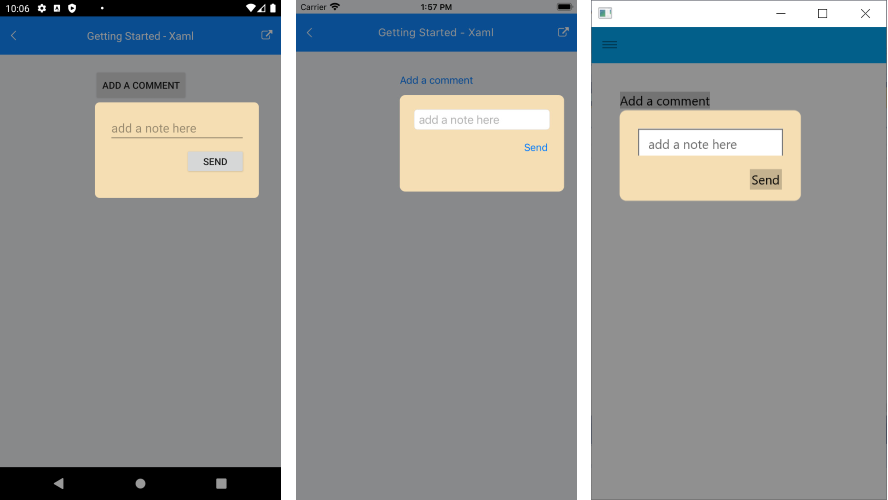

# Getting Started

This guide provides the information you need to start using the Telerik UI for .NET MAUI Popup by adding the control to your project.

At the end, you will be able to achieve the following result.



## Prerequisites

Before adding the Popup, you need to:

1. [Set up your .NET MAUI application](#set-up-your-net-maui-application).

1. [Download Telerik UI for .NET MAUI](#download-telerik-ui-for-net-maui).

1. [Install Telerik UI for .NET MAUI](#install-telerik-ui-for-net-maui).

## Define the Control

1. When your .NET MAUI application is set up, you are ready to add a Popup control to your page.

	For demonstration purposes, the current scenario demonstrates how to add a sample Popup attached to a Button control. The purpose of the Popup here is to receive user input&mdash;it contains the Entry control for allowing the user to enter a comment and a button for closing the popup.

 ```XAML
<Button HorizontalOptions="Center"
	VerticalOptions="Start"
	Text="Add a comment"
	Clicked="ShowPopup">
	<telerikPrimitives:RadPopup.Popup>
		<telerikPrimitives:RadPopup x:Name="popup"
									IsModal="True"
									OutsideBackgroundColor="#6F000000">
			<telerikMauiControls:RadBorder CornerRadius="8"
										   BackgroundColor="Wheat">
				<Grid Padding="20"
					  WidthRequest="200"
					  HeightRequest="100">
					<Grid.RowDefinitions>
						<RowDefinition Height="30" />
						<RowDefinition Height="40" />
					</Grid.RowDefinitions>
					<Entry Placeholder="add a note here" />
					<Button Grid.Row="1"
						Padding="2"
						HorizontalOptions="End"
						Text="Send"
						Clicked="ClosePopup" />
				</Grid>
			</telerikMauiControls:RadBorder>
		</telerikPrimitives:RadPopup>
	</telerikPrimitives:RadPopup.Popup>
</Button>
 ```

1. Reference the event handlers.

 ```C#
private void ClosePopup(object sender, EventArgs e)
{
    popup.IsOpen = false;
}
private void ShowPopup(object sender, EventArgs e)
{
    popup.IsOpen = true;
}
 ```

1. Add the namespace. Note that the `telerikMauiControls` namespace is needed by the Border control that is used in the example while it is not required for the Popup to work properly.

 ```XAML
xmlns:telerikPrimitives="clr-namespace:Telerik.XamarinForms.Primitives;assembly=Telerik.Maui.Controls.Compatibility"
xmlns:telerikMauiControls="clr-namespace:Telerik.Maui.Controls;assembly=Telerik.Maui.Controls"
 ```

## See Also

- [Modal Popup Support](#modal-popup)
- [Placement Configuration](#placement-configuration)
- [Animation Settings](#animation-settings)
