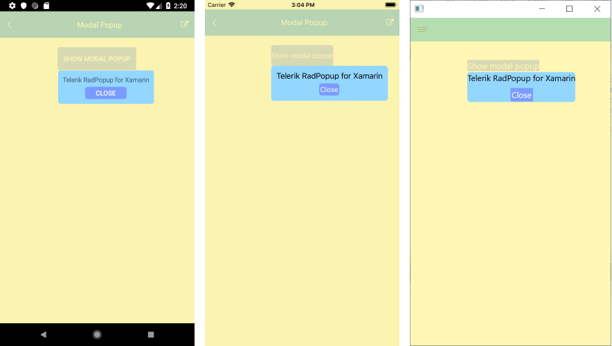

# .NET MAUI Popup Styling

The `OutsideBackgroundColor` property of the Popup lets you customize the color outside the element.

In most cases, this feature is used for modal popups to indicate that the user cannot interact with the UI behind. The default value is `Color.Transparent`.

You can apply the transparency of the overlay through the alpha channel of the chosen color. If you're using a hexadecimal code, its format has to be `#AARRGGBB`, where the first pair of letters, the `AA`, represents the alpha channel.

Below is an example on how to apply `OutsideBackgroundColor` to a modal popup.

```XAML
<Button HorizontalOptions="Center"
        VerticalOptions="Start"
        BackgroundColor="#7A9BFF"
        TextColor="White"
        Text="Show modal popup"
        Clicked="ShowPopup"
        x:Name="button">
    <telerik:RadPopup.Popup>
        <telerik:RadPopup x:Name="popup"
                                    IsModal="True"
                                    OutsideBackgroundColor="#B3FFF493">
            <telerik:RadBorder
                CornerRadius="6"
                BackgroundColor="#93D7FF"
                Padding="10">
                <Grid>
                    <Grid.RowDefinitions>
                        <RowDefinition Height="Auto" />
                        <RowDefinition Height="26" />
                    </Grid.RowDefinitions>
                    <Label Text="Telerik RadPopup for .NET MAUI" />
                    <Button Grid.Row="1"
                            Padding="2"
                            HorizontalOptions="Center"
                            Text="Close"
                            Clicked="ClosePopup"
                            CornerRadius="6"
                            BackgroundColor="#7A9BFF"
                            TextColor="White" />
                </Grid>
            </telerik:RadBorder>
        </telerik:RadPopup>
    </telerik:RadPopup.Popup>
</Button>
```

Set the needed event handlers that are used to show or hide the popup:

```C#
private void ClosePopup(object sender, EventArgs e)
{
    popup.IsOpen = false;
}
private void ShowPopup(object sender, EventArgs e)
{
    popup.IsOpen = true;
}
```

The following image shows a Popup with an applied overlay color on different platforms:



## See Also

- [Modal Popup]()
