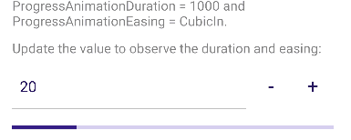
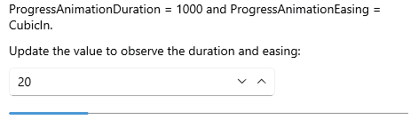
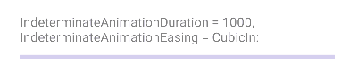
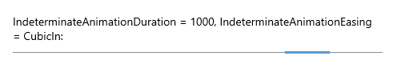

# .NET MAUI ProgressBar Animations

ProgressBar for .NET MAUI allows you to apply different animation easing while changing its `Value` and an animation while in **Indeterminate mode**. In addition you can change the animation duration. 

## Animation during progress change

Customize the animation duration and easing through `ProgressAnimationDuration` and `ProgressAnimationEasing` properties.

* `ProgressAnimationDuration`(`int`)&mdash;Defines the duration of the animation while control's value changes. The default value is `800`.
* `ProgressAnimationEasing`(`Microsoft.Maui.Easing)`)&mdash;Specifies animation acceleration over time. The default value is `Easing.Linear`.

Example with `ProgressAnimationDuration` and `ProgressAnimationEasing`.

The snippet below shows a simple `RadLinearProgressBar` definition. The ProgressBar `Value` changes when using the Stepper control. The animation occurs when the control `Value` changes.

<snippet id='progressbar-progress-animation-duration-easing'/>

Add the following namespace:

```XAML
xmlns:telerik="http://schemas.telerik.com/2022/xaml/maui"
```

Here is the result on Android:



Here is the result on WinUI:



## Animation when Indeterminate Mode 

Customize the indeterminate animation duration and easing through `IndeterminateAnimationDuration` and `IndeterminateAnimationEasing` properties.

* `IndeterminateAnimationDuration`(`int`)&mdash;Defines the duration of the animation while in Indeterminate mode. The default value is `800`.
* `IndeterminateAnimationEasing`(`Microsoft.Maui.Easing)`)&mdash;Specifies animation acceleration over time. The default value is `Easing.Linear`.

The following code snippet provides an example with `IndeterminateAnimationDuration` and `IndeterminateAnimationEasing`.

The snippet below shows a simple `RadLinearProgressBar` definition:

<snippet id='progressbar-indeterminate-animation-duration-easing'/>

Add the following namespace:

```XAML
xmlns:telerik="http://schemas.telerik.com/2022/xaml/maui"
```

Here is the result on Android:



Here is the result on WinUI:



>important For the ProgressBar Animation example refer to the [SDKBrowser Demo Application]().

## See Also

- [Configuration]()
- [Indeterminate Mode]()
- [Events]()
- [Styling]()
