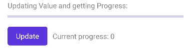
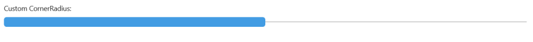
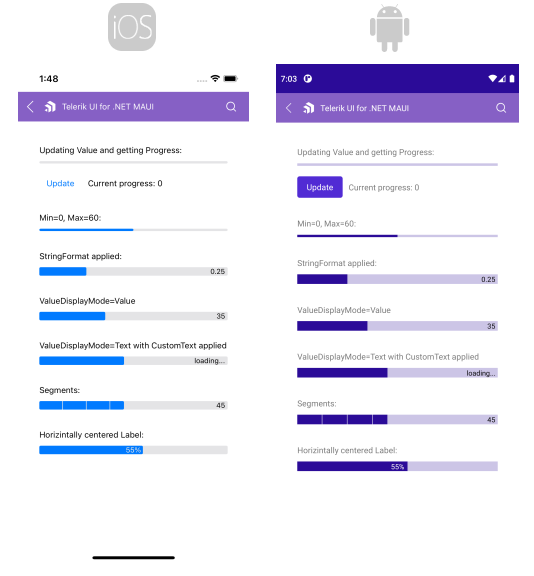
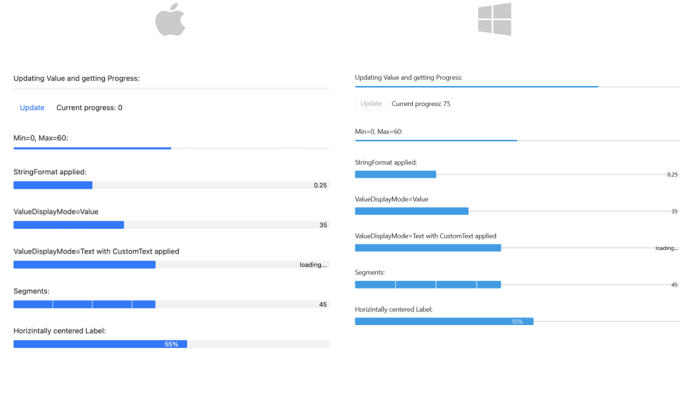

# .NET MAUI ProgressBar Configuration

This article will explain all configuration options that ProgressBar control provides.

## Value and Progress

The LinearProgressBar exposes `Value` and `Progress` properties which are used to set and report, respectively, the progress of a task inside the ProgressBar control.

* `Value`(`double`)&mdash;Sets the value of the ProgressBar. When `Value` property is updated, this initiates the progress animation of the progress bar.
* `Progress`(`double`)&mdash;Reports the current progress of the ProgressBar. `Progress` property is updated internally after `Value` is updated and progress animation is complete.

Here is a quick example showing how you can update `Value` and get the `Progress`:

<snippet id='progressbar-configuration-value'/>

And the Update button click event handler:

<snippet id='progressbar-configuration-valueupdated'/>

Check the result in the .GIF file below:

## Value Range

`Minimum` and `Maximum` properties are used to set the minimum and maximum values that the ProgressBar can display.

* `Minimum`(`double`)&mdash;Specifies the lower limit of the `Value` property, by default its value is 0.
* `Maximum`(`double`)&mdash;Defines the upper limit of the `Value` property, default value is 100.

You can define `Minimum` and `Maximum` properties of the ProgressBar as shown below:

<snippet id='progressbar-configuration-minmax'/>

## String Format

The `StringFormat`(`string`) specifies the string format applied to the numeric value showing the progress. You can find detailed information about the supported numeric formats in the [Standard Numeric Format Strings](https://docs.microsoft.com/en-us/dotnet/standard/base-types/standard-numeric-format-strings) Microsoft documentation.

<snippet id='progressbar-configuration-stringformat'/>

## Value Display Mode

`ValueDisplayMode` property of enum type `Telerik.Maui.Controls.ValueDisplayMode` can be set to any of the following values:

* (default) Percent&mdash;Displays the progress as percent from the range from minimum to maximum;
* Value&mdash;Displays the Progress value.
* Text&mdash;Shows custom text inside the progress bar label. You need to combine it with `CustomText` property of the ProgressBar.
* None&mdash;No text is shown inside the progress bar.

Here is a quick example with `ValueDisplayMode` set to `Value`:

<snippet id='progressbar-configuration-valuedisplaymode'/>

You can also use `ValueDisplayMode` set to `Text` together with `CustomText`:

<snippet id='progressbar-configuration-customtext'/>

## Segments

Divide the ProgressBar in segments using the `SegmentCount`(`int`) property.

<snippet id='progressbar-configuration-segments'/>

How to style the segments refer to [Styling the segments](#styling-the-segments) section.

## Label Alignment

The ProgressBar exposes `LabelHorizontalOptions` property of type `Microsoft.Maui.Controls.LayoutOptions` which defines the horizontal alignment of the label showing the progress. By default `LabelHorizontalOptions` is `LayoutOptions.End`.

<snippet id='progressbar-configuration-labelalignment' />

## Corners

You can define corners of the progress indicator by setting the `ProgressCornerRadius`(`Microsoft.Maui.CornerRadius`) property. 

Define corners to the background track by setting the `TrackCornerRadius`(`Microsoft.Maui.CornerRadius`) property.

<snippet id='progressbar-styling-corner-radius'/>

`TrackCornerRadius` on WinUI:

>important For the ProgressBar Configuration example refer to the [SDKBrowser Demo Application]().

Here is how the Configuration example looks on iOS and Android:

And how the example looks on `MacCatalyst` and `WinUI`: 

## See Also

- [Animations]()
- [Indeterminate Mode]()
- [Events]()
- [Styling]()
