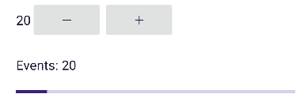
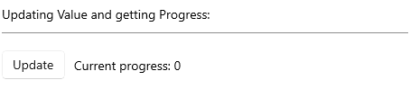

# .NET MAUI ProgressBar Events

The ProgressBar for .NET MAUI exposes the following events:

* `ProgressChanged` event is raised when progress is changed. The `ProgressChanged` event handler receives two parameters:

	* A `ProgressChangedEventArgs` which has a `Progress`(`double`) property. Using this property you can get the current progress of the ProgressBar control.

* `ProgressCompleted` event is raised when the Value of the ProgressBar reaches the `Maximum` value.


**Example with ProgressChanged and ProgressCompleted events**

A simple `RadLinearProgressBar` definition:

<snippet id='progressbar-events'/>

Add the following namespace:

```XAML
xmlns:telerik="http://schemas.telerik.com/2022/xaml/maui"
```

`ProgressChanged` event in code behind. The Label text is updated with the current `Progress` value:

<snippet id='progressbar-progresschanged-event'/>

`ProgressCompleted` event in code behind. The Label text is updated with `Text = "Completed"` when the progress reaches the `Maximum` value:

<snippet id='progressbar-progresscompleted-event'/>

The final result when using the `ProgressChanged` and `ProgressCompleted` events on Android:



And on WinUI:



>important For the ProgressBar Events example refer to the [SDKBrowser Demo Application]().

## See Also

- [Configuration]()
- [Indeterminate Mode]()
- [Styling]()
