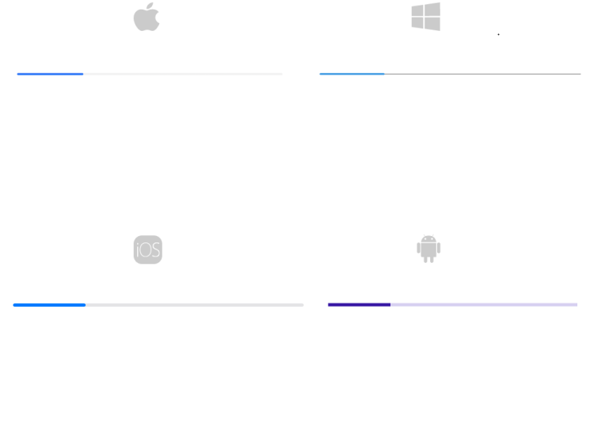

# Getting Started with .NET MAUI ProgressBar control

This guide provides the information you need to start using the Telerik UI for .NET MAUI ProgressBar by adding the control to your project.

At the end, you will be able to achieve the following result.



## Prerequisites

Before adding the Barcode, you need to:

1. [Set up your .NET MAUI application](#step-1-set-up-your-net-maui-application).

1. [Download Telerik UI for .NET MAUI](#step-2-download-telerik-ui-for-net-maui).

1. [Install Telerik UI for .NET MAUI](#step-3-install-telerik-ui-for-net-maui).

## Define the Control in XAML or C#.

1. The snippet below shows a simple `RadLinearProgressBar` definition.

 <snippet id='progressbar-getting-started-xaml'/>
 <snippet id='progressbar-getting-started-csharp'/>

1. Add the `telerik` namespace:

 ```XAML
xmlns:telerik="http://schemas.telerik.com/2022/xaml/maui"
 ```

1. Register the Telerik controls through the `Telerik.Maui.Controls.Compatibility.UseTelerik` extension method called inside the `CreateMauiApp` method of the `MauiProgram.cs` file of your project:

```C#
 using Telerik.Maui.Controls.Compatibility;

 public static class MauiProgram
 {
	public static MauiApp CreateMauiApp()
	{
		var builder = MauiApp.CreateBuilder();
		builder
			.UseTelerik()
			.UseMauiApp<App>()
			.ConfigureFonts(fonts =>
			{
				fonts.AddFont("OpenSans-Regular.ttf", "OpenSansRegular");
			});

		return builder.Build();
	}
 }           
```

>important For the ProgressBar Getting Started example refer to the [SDKBrowser Demo Application]().

## Additional Resources

- [.NET MAUI ProgressBar product page](https://www.telerik.com/maui-ui/progressbar)
- [.NET MAUI ProgressBar forum page](https://www.telerik.com/forums/maui?tagId=1978)
- [Telerik .NET MAUI blogs](https://www.telerik.com/blogs/mobile-net-maui)
- [Telerik .NET MAUI roadmap](https://www.telerik.com/support/whats-new/maui-ui/roadmap)

## See Also

- [Configuration]()
- [Animations]()
- [Indeterminate Mode]()
- [Events]()
- [Styling]()
