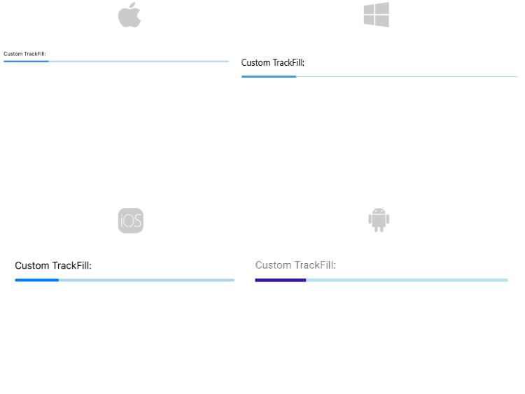
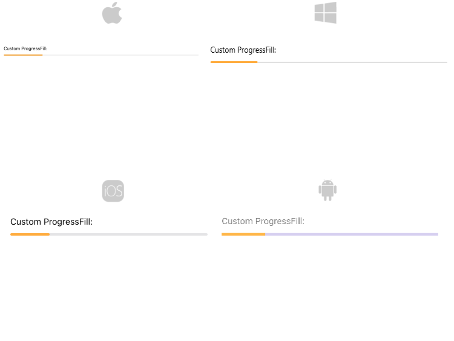
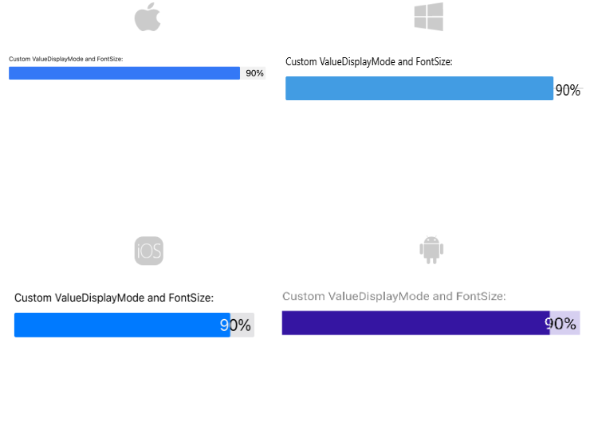
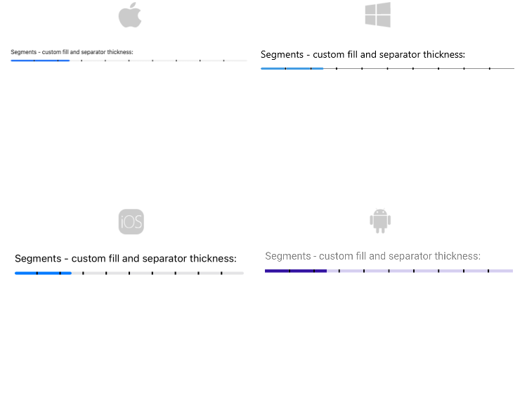
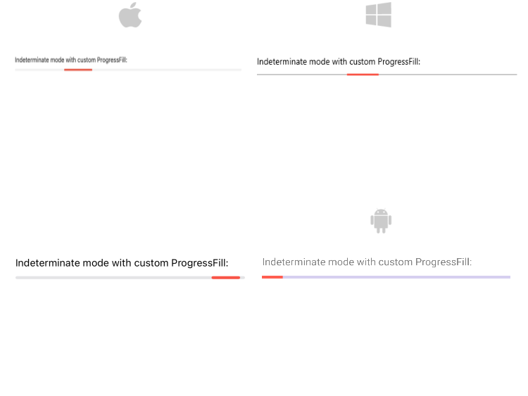

# .NET MAUI ProgressBar Styling

The ProgressBar control for .NET MAUI provides styling options for customizing its appearance.

* `TrackFill`(`Brush`)&mdash;Specifies the color of the background track.
* `TrackThickness`(`double`)&mdash;Specifies the thickness of the background track.
* Define corners to the background track by setting the `TrackCornerRadius`(`Microsoft.Maui.CornerRadius`) property.

<snippet id='progressbar-styling-trackfill'/>

* `ProgressFill`(`Brush`)&mdash;Specifies the color of the progress indicator.
* Define corners of the progress indicator by setting the `ProgressCornerRadius`(`Microsoft.Maui.CornerRadius`) property. 

<snippet id='progressbar-styling-progressfill'/>

## Styling the text

The following properties are related to the text displayed in the ProgressBar:

* `TextColor`(`Color`)&mdash;Defines the color of the Text which displays the progress value.
* `AlternateTextColor`(`Color`)&mdash;Defines the text color when the progress indicator overlaps the label which displays the current progress.
* `FontSize`(`double`)&mdash;Defines the font size of the Text which displays the progress value

<snippet id='progressbar-styling-text'/>

## Styling the segments

Style the ProgressBar segments using the following properties:

* `SegmentSeparatorFill`(`Brush`)&mdash;Specifies the fill of the segments separators.
* `SegmentSeparatorThickness`(`double`)&mdash;Sets the thickness of the segments separators.

<snippet id='progressbar-styling-separator-segments'/>

## Styling the indeterminate mode

For indeterminate mode you can style the ProgressBar using the `ProgressFill`(`Brush`) property.

<snippet id='progressbar-styling-indeterminate-mode'/>

>important For the ProgressBar Styling example refer to the [SDKBrowser Demo Application]().

## See Also

- [Configuration]()
- [Indeterminate Mode]()
- [Events]()
