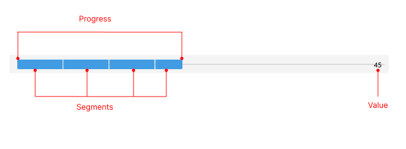

# .NET MAUI ProgressBar Visual Structure

The visual structure of the .NET MAUI ProgressBar represents the anatomy of the UI component. Being familiar with the visual elements of the ProgressBar allows you to quickly find the information required to configure them.

The following image shows the anatomy of the ProgressBar.

## Displayed Elements

* **Main Content**&mdash;
*
## See Also

* [Getting Started]()
* [SideDrawer Configuration]()
* [SideDrawer Commands]()