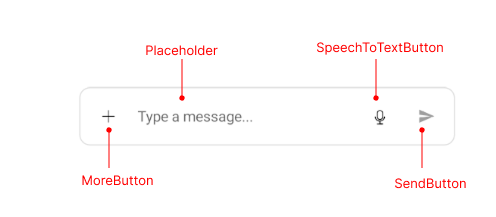
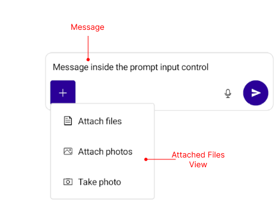

# .NET MAUI PromptInput Visual Structure

The visual structure of the .NET MAUI PromptInput represents the anatomy of the UI control. Being familiar with the visual elements of the PromptInput allows you to quickly find the information required to configure them.

The images in this article show the anatomy of the PromptInput and its building blocks.

## PromptInput Structure

* **MoreButton**&mdash;Represents the 'More' button, which opens a menu with additional actions.
* **Placeholder**&mdash;Represents the placeholder text displayed when the input area is empty.
* **SpeechToTextButton**&mdash;Represents the button that activates the speech-to-text functionality.
* **SendButton**&mdash;Represents the button used to send the message.

## Attached Files View Structure and Messages Structure

* **Attached Files View**&mdash;Represents the view that displays the files attached to the prompt.
* **Messages**&mdash;Represents the messages typed in the input area.

## See Also

- [Getting Started]()
- [Configuration]()
- [Affix Content]()
- [Commands]()
- [Styling]()