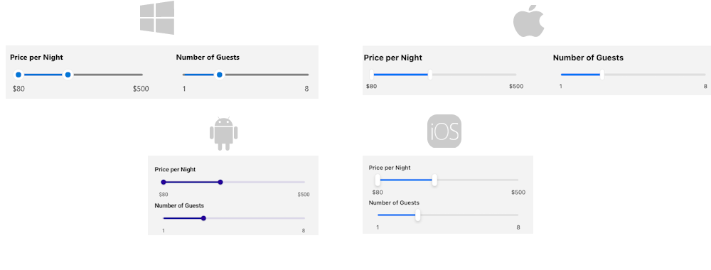

# .NET MAUI RangeSlider Overview

 The Telerik UI for .NET MAUI RangeSlider represents a slider control that displays a start-end range in a given min-max range. The end user can change the values of the range by dragging the start thumb, end thumb, and range track. RangeSlider supports ticks, labels and tooltips to help users quickly identify the selected range and easily modify it if needed. 

## Key Features

* [Range Thumb]()&mdash;Through the draggable range thumb users can quickly update the selected range.
* [Ticks]()&mdash;Add ticks to the range slider's track in order to enable users to easily identify the range values.
* [Labels]()&mdash;Display labels along the track for clarity of what the underlying min-max range is.
* [Tooltips]()&mdash;RangeSlider can show customizable tooltips to help the users select the desired range.
* Flexible Styling API&mdash;You have full control over the appearance of the RangeSlider's [range thumb](), [track](), [ticks]() and [labels]().

## Next Steps

- [Getting Started with Telerik UI for .NET MAUI RangeSlider]()

## See Also

- [Telerik .NET MAUI Blogs](https://www.telerik.com/forums/maui?tagId=2058)
- [Telerik .NET MAUI Roadmap](https://www.telerik.com/support/whats-new/maui-ui/roadmap)