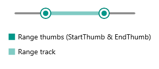

# Range Thumb Styling

RangeSlider for .NET MAUI provides styling options for its range thumb.  The range thumb includes start thumb, end thumb and range track. These elements can be styled separately through Fill and Style properties:

* `StartThumbFill(Color)`&mdash;Applies fill color to the start thumb.
* `RangeTrackFill(Color)`&mdash;Defines fill color to the track range.
* `EndThumbFill(Color)`&mdash;Sets fill color to the end thumb.

* `StartThumbStyle(Style)`&mdash;Defines a custom style to the start thumb.
* `RangeTrackStyle(Style)`&mdash;Applies a custom style to the range track.
* `EndThumbStyle(Style)`&mdash;Defines a custom style to the end thumb.

Here is a quick example on how styling properties can be applied to the RangeSlider:

**1.** Add the styles to the page resources:

<snippet id='rangeslider-rangethumb-styling' />

**2.** Define the RangeSlider with the above style properties as well as Fill properties applied:

<snippet id='rangeslider-rangethumb-styling-xaml' />

Check the result below:

## See Also

- [Range Thumb]()