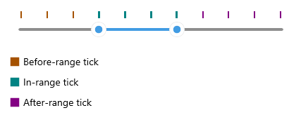

# Ticks Styling

The RangeSlider for .NET MAUI control provides styling properties for its ticks as well as a style selector, which you can use to apply different styles to the ticks according to custom logic.

 * `InRangeTickColor`(`Color`)&mdash;Defines the color of the ticks that are within the start-end range.
 * `OutOfRangeTickColor`(`Color`)&mdash;Specifies the color of the ticks that are outside of the start-end range.
 * `TickThickness`(`double`)&mdash;Defines the width of the ticks.
 * `InRangeTickStyle`(`Style`)&mdash;Specifies custom style to the ticks that are within the start-end range.
 * `OutOfRangeTickStyle`(`Style`)&mdash;Specifies custom style to the ticks that are outside of the start-end range.

 * `TicksStyleSelector(type Telerik.Maui.Controls.IStyleSelector)`&mdash;Defines a selector that can apply different styles for different ticks.

Here is a quick example on how the `TicksStyleSelector` can be applied to set separate styles to the ticks before the selected range, inside the selected range and after the selected range.

**1.** Create a custom style selector class which inherits from `Telerik.Maui.Controls.IStyleSelector`:

<snippet id='rangeslider-ticks-styleselector-class' />

>`Telerik.Maui.Controls.IStyleSelector` provides a mechanism to select a `Microsoft.Maui.Controls.Style` based on a custom logic.

**2.** Add The style selector to the page's resources:

<snippet id='rangeslider-ticksttyling-selector'/>

**3.** Define the RangeSlider with the style selector applied:

<snippet id='rangeslider-ticksttyling-style'/>

Check the result below:

## See Also

- [Ticks]()
- [Track Styling]()
- [Labels Styling]()