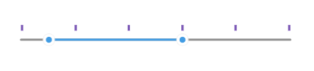

# Ticks

The RangeSlider for .NET MAUI can show ticks along the track in order to enable users to easily identify the range values.

## Ticks Step and Placement

To display ticks along the track, define `TickStep` and `TickPlacement` properties of the RangeSlider.

* `TickStep(double)`&mdash;Defines at what positions/values ticks will be displayed.
* `TicksPlacement(type Telerik.Maui.Controls.RangeSlider.SliderTicksPlacement)`&mdash;Specifies the position of the ticks in the RangeSlider with respect to its track. The available options are:
    * `None`&mdash;no ticks are displayed.
    * `Start`&mdash;ticks appear above the track.
    * `Center`&mdash;ticks appear in the track area of the slider, overlaying the track.
    * `End`&mdash;ticks appear below the track.

## RangeSlider SnapMode

RangeSlider for .NET MAUI provides snapping to ticks thus limiting `RangeStart` and `RangeEnd` to a predefined set of values depending on `TickStep` value. You can control whether the snapping is enabled through `SnapMode` property:

* `SnapMode(type Telerik.Maui.Controls.RangeSlider.SliderSnapMode)`&mdash;Defines whether a value should be snapped to a tick while the end-user is dragging a start thumb, end thumb or the range track. Available options are:
    * `None`&mdash;The end user can move the dragged thumb freely.
    * `SnapToTicks`&mdash;The start and end thumbs are snapped to the position of the ticks when an end-user is dragging them.

The snippet below shows how the ticks configuration settings can be applied:

<snippet id='rangeslider-ticks-settings' />

Check the result below:

## Tick Template

Through the `TickTemplate` property you can customize the appearance of the ticks.

* `TickTemplate (DataTemplate)`&mdash;Defines the template of the RangeSlider ticks.

Check below a sample `TickTemplate` example:

**1.** First define the custom DataTemplate:

<snippet id='rangeslider-ticks-ticktemplate-datatemplate' />

**2.** Then apply it to the RangeSlider's `TickTemplate`:

<snippet id='rangeslider-ticks-ticktemplate-xaml' />

## See Also

- [Track Configuration]()
- [Labels]()
- [Ticks Styling]()