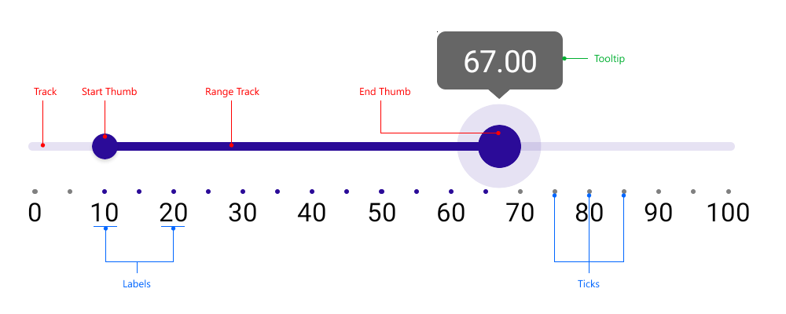

# .NET MAUI RangeSilder Visual Structure

The visual structure of the .NET MAUI RangeSlider represents the anatomy of the UI component. Being familiar with the visual elements of the RangeSlider allows you to quickly find the information required to configure them.

The following image shows the anatomy of the RangeSlider.

## Displayed Elements

- `Track`&mdash;The part of the range slider the range thumb sildes across.
- `Start Thumb`&mdash;A draggable handle which represents the range start.
- `Range Track`&mdash;The part of the range slider that represents the selected range. When dragged, RangeStart and RangeEnd are updated simulteneously.
- `End Thumb`&mdash;A draggable handle which represents the range end.
- `Ticks` and `Labels`&mdash;Used for clarity of what the underlying min-max range is.
- `Tooltips`&mdash; Used for clarity of what the value corresponding to the dragged element is.

## See Also

- [.NET MAUI RangeSlider Product Page](https://www.telerik.com/maui-ui/rangeslider)
- [Telerik .NET MAUI Blogs](https://www.telerik.com/blogs/mobile-net-maui)
- [Telerik .NET MAUI Roadmap](https://www.telerik.com/support/whats-new/maui-ui/roadmap)