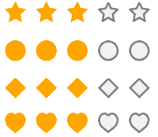

# Overview

**Telerik Rating for .NET MAUI** is UI component that allows users to intuitively rate by selecting number of items [stars] from a predefined number of items.

## Key features

* [Predefined rating shapes](): RadRating provides several simple shapes such as star, circle and diamond, that can be used for rating items out of the box.
* [Customizing shapes](#shapes-styling): You could take advantage of the control’s flexible API for customizing the appearance of the predefined shapes.
* [Custom items template support](): The Rating control provides two templates options for normal state and selected state, allowing you to achieve the desired look and feel.
* [Read-Only Mode](): restrict the end user to change the Value of the selected items. 

## See Also

- [Getting Started]()
- [Configuration]()
- [Shape Rating]()
- [Templated Rating]()
