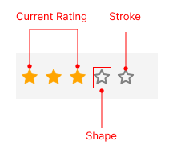

# .NET MAUI Rating Visual Structure

The visual structure of the .NET MAUI Rating represents the anatomy of the UI component. Being familiar with the visual elements of the Rating allows you to quickly find the information required to configure them.

The following image shows the anatomy of the Rating.

## Displayed Elements

* **Shape**&mdash;Represents the shape used to display the rating value. You can customize it by setting the `ItemShape` property.
* **Current Rating**&mdash;Represents the current rating value displayed by the control. You can set it by using the `Value` property.
* **Stroke**&mdash;Represents the stroke color of the border around the shape.

## See Also

- [Getting Started with .NET MAUI Rating]()
- [Shapes]()
