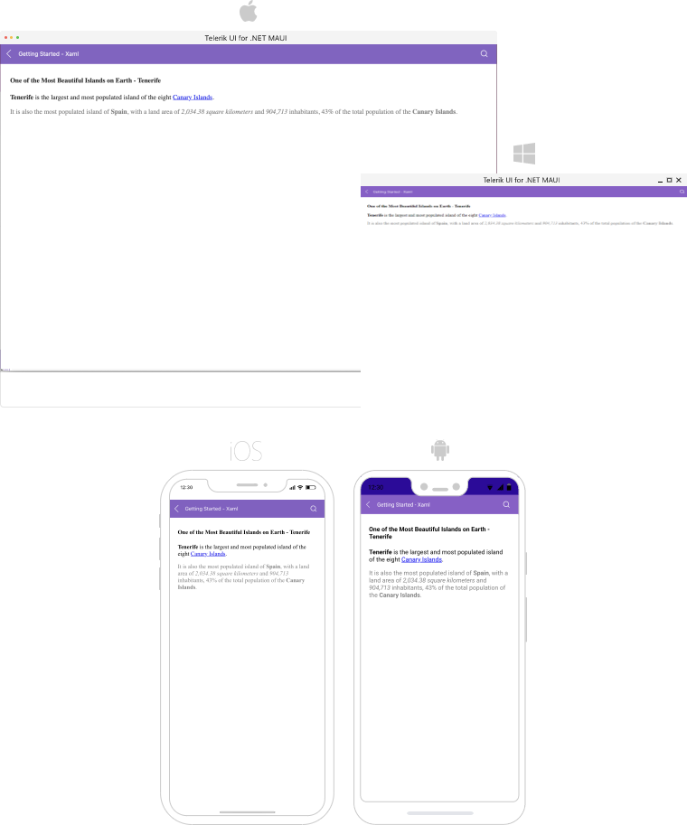

# Getting Started with the .NET MAUI RichTextEditor

This article will guide you through the steps needed to add a basic RichTextEditor control in your application.

This guide provides the information you need to start using the [Telerik UI for .NET MAUI RichTextEditor]() by adding the control to your project.

At the end, you will achieve the following result.



## Prerequisites

Before adding the RichTextEditor, you need to:

1. [Set up your .NET MAUI application](#step-1-set-up-your-net-maui-application).

1. [Download Telerik UI for .NET MAUI](#step-2-download-telerik-ui-for-net-maui).

1. [Install Telerik UI for .NET MAUI](#step-3-install-telerik-ui-for-net-maui).

## Define the Control

When your .NET MAUI application is set up, you are ready to add a RichTextEditor control to your page. The following example shows a sample RichTextEditor definition.

> `RadRichTextEditor` relies on WebView for the rendering of HTML content. Some of the limitations for placing WebView on the page which are also valid for RichTextEditor:
>
> - Nesting `RadRichTextEditor` inside a ScrollView control is not supported. `RadRichTextEditor` provides its own scrolling mechanism.
>
> - When the `RadRichTextEditor` is placed inside a `StackLayout`, you need to set explicitly its `WidthRequest` and `HeightRequest` properties, otherwise the control will not render. This is because `StackLayout` usually wants to size itself according to its children, but a WebView (since it does scrolling) wants to size itself to its parent. You can learn more about this in the [.NET MAUI WebView documentation](https://learn.microsoft.com/en-us/dotnet/maui/user-interface/controls/webview?pivots=devices-windows).

>
> You have to either use a Grid as a parent container or explicitly define the size of the RichTextEditor control.


**1.** Set up the `RichTextEditor` instance:

<snippet id='richtexteditor-getting-started-xaml' />

In addition to this, you need to add the following namespace:

**2.** Add the `telerik` namespaces:

```XAML
xmlns:telerik="http://schemas.telerik.com/2022/xaml/maui"
```

## Loading HTML Content

With RichTextEditor, users can create and edit HTML content. In some cases, you may need to load formatted text in advance—you can achieve this through the `Source` property of the control:

<snippet id='richtexteditor-getting-started' />

Register the Telerik controls through the `Telerik.Maui.Controls.Compatibility.UseTelerik` extension method called inside the `CreateMauiApp` method of the `MauiProgram.cs` file of your project:

```C#
using Telerik.Maui.Controls.Compatibility;

public static class MauiProgram
{
	public static MauiApp CreateMauiApp()
	{
		var builder = MauiApp.CreateBuilder();
		builder
			.UseTelerik()
			.UseMauiApp<App>()
			.ConfigureFonts(fonts =>
			{
				fonts.AddFont("OpenSans-Regular.ttf", "OpenSansRegular");
			});

		return builder.Build();
	}
}           
```

> For a runnable example with the RichTextEditor Getting Started scenario, see the [SDKBrowser Demo Application]() and go to **RichTextEditor > Getting Started** category.

## Additional Resources

- [Commands]()
- [Configure the RichTextEditor]()
- [Events]()
- [Working with images]()
- [Hyperlinks]()

## See Also

- [.NET MAUI RichTextEditor Product Page](https://www.telerik.com/maui-ui/richtexteditor)
- [.NET MAUI RichTextEditor Forum Page](https://www.telerik.com/forums/maui?tagId=2060)
- [Telerik .NET MAUI Blogs](https://www.telerik.com/blogs/mobile-net-maui)
- [Telerik .NET MAUI Roadmap](https://www.telerik.com/support/whats-new/maui-ui/roadmap)
