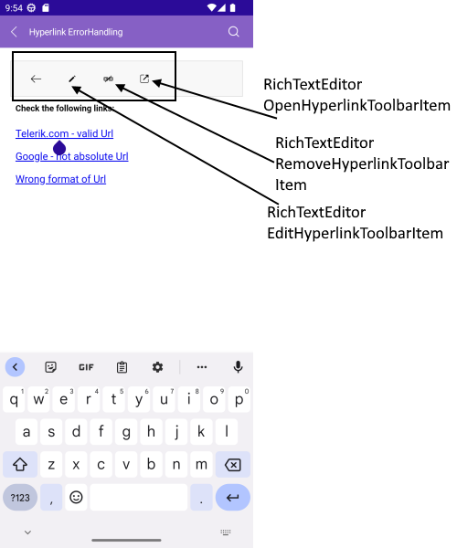
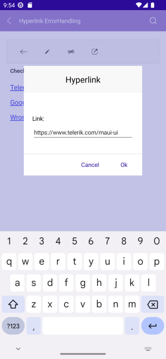
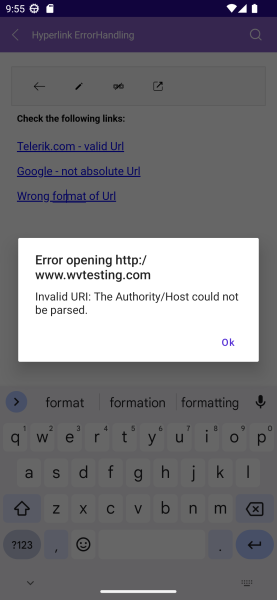

# Hyperlink Support

RichTextEditor provides built-in support for creating and managing hyperlinks. Through the exposed commands related to hyperlinks, namely `ApplyHyperlinkCommand`, `RemoveHyperlinkCommand`, and `OpenHyperlinkCommand`, users can manipulate the hyperlinks inside the RichTextEditor content.

In addition, `RichTextEditorToolbar` exposes predefined toolbar items wired to the hyperlink commands. 

* `RichTextEditorAddHyperlinkToolbarItem`&mdash;Opens a popup to enter URL information and executes an action that adds a hyperlink for the current selection.
* `RichTextEditorAddOrEditHyperlinkToolbarItem`&mdash;Opens a popup to enter URL information and executes an action that adds or edits a hyperlink for the current selection.
* `RichTextEditorHyperlinkNavigationToolbarItem`&mdash;This toolbar item adds or edits hyperlinks depending whether a hyperlink is selected. If a hyperlink is selected, the editor navigates to toolbar sub-items for operations related to a hyperlink. If a hyperlink is not selected, a popup with a dialog is displayed to enter URL information and add a hyperlink for the current selection.

## Additional Toolbar Items for Hyperlink Operations

The `RichTextEditorHyperlinkNavigationToolbarItem` has the following items:

* `RichTextEditorEditHyperlinkToolbarItem`&mdash;Edits the hyperlink from the current selection.
* `RichTextEditorRemoveHyperlinkToolbarItem`&mdash;Removes the hyperlink from the current selection.
* `RichTextEditorOpenHyperlinkToolbarItem`&mdash;Navigates to the URL.

The next image shows the `RichTextEditorEditHyperlinkToolbarItem` on mobile platforms:

For more details, see the [RichTextEditor Toolbar](#predefined-toolbar-items) topic.

## Methods

You can also take advantage of the following API related to hyperlinks:

* `GetHyperlinkAsync` method&mdash;Asynchronously returns a RichTextHyperlink under the caret in the editor (or `null` if no hyperlink is present). The `RichTextHyperlink` object contains the `Url` and `Title` of the link.

## Hyperlink Error Handling

In case users try to open invalid URLs (for example, the URL is not absolute, the domain does not exist or is incomplete, and so on), the following message is shown by default and indicates that the URL has an error:

You can override the default behavior by handling the RichTextEditor's `OpenHyperlinkError` event:

* `OpenHyperlinkError` event&mdash;Raised when users try to open invalid URLs in the editor. The `OpenHyperlinkError` event handler receives two parameters:

	* The <code>Sender</code> which is the RichTextEditor control.
	* `OpenHyperlinkErrorEventArgs` provides the following properties:
		* `Error`&mdash;of type `System.Exception`, can be used to get the exact error message.
		* `Url`&mdash;of type `string`, defining the URL of the hyperlink.
		* `Handled`&mdash;boolean property indicating whether the event is handled.

To change the default error handling behavior:

1. Subscribe to the event.
1. Set the <code>Handled</code> property of the event args to `True` to prevent the default message.
1. Add a custom implementation. 

The following example demonstrates how to use the `OpenHyperlinkError` event:

<snippet id='richtexteditor-hyperlinkerrorhandling-xaml' />

The next snippet shows the event handler which shows a custom message:

<snippet id='richtexteditor-hyperlinkerrorhandling-code' />

> For a runnable example with the RichTextEditor Hyperlink Error Handling, see the [SDKBrowser Demo Application]() and go to **RichTextEditor > Events**.

## See Also

- [Commands]()
- [Configure the RichTextEditor]()
- [Events]()
- [Working with images]()