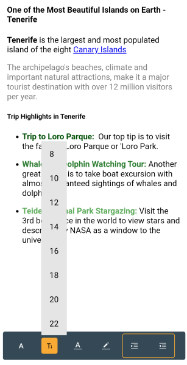

# RichTextEditor Toolbar Styling

The [.NET MAUI RichTextEditor]() provides a flexible styling API for its toolbar items. 

The `RichTextEditorToolbar` is based on the `RadToolbar` control. All toolbar items in the RichTextEditor inherit from `ButtonToolbarItem`.

All styling properties available for the `ButtonToolbarItem` are applicable for the rich text editor toolbar items.

Here is an example:

**1.** RichTextEditor and Toolbar definitions in XAML:

<snippet id='richtexteditor-toolbar-styling-xaml' />

**2.** Add the `telerik` namespaces:

```XAML
xmlns:telerik="http://schemas.telerik.com/2022/xaml/maui"
```

**3.** And the Styles in the Resources of the page :

<snippet id='richtexteditor-toolbar-styling-resource' />

**4.** This is the result:



> For the RichTextEditor Toolbar Styling example, see the [SDKBrowser Demo Application]() and go to **RichTextEditor -> Styling**.
