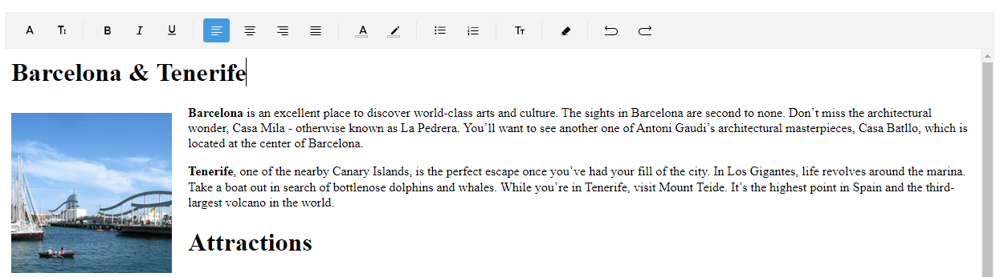

# RichTextEditor Custom Toolbar

You can easily customize the toolbar by setting the `AutoGenerateItems` to `False`. Then decide which toolbar items to include.

Here is an exmaple with custom toolbar items: 

**1.** RichTextEditor and Toolbar definitions in XAML:

<snippet id='richtexteditor-custom-toolbar-xaml' />

**2.** Add the `telerik` namespaces:

```XAML
xmlns:telerik="http://schemas.telerik.com/2022/xaml/maui"
```

**3.** Load the html document in the RichTextEditor:

<snippet id='richtexteditor-toolbar-load-source' />

**4.** And the result:



>important For the RichTextEditor Custom Toolbar example refer to the [SDKBrowser Demo Application]() RichTextEditor -> Toolbar category.

## See Also

- [Commands]()
- [Configure the RichTextEditor]()
- [Events]()
- [Working with images]()
- [Hyperlinks]()
