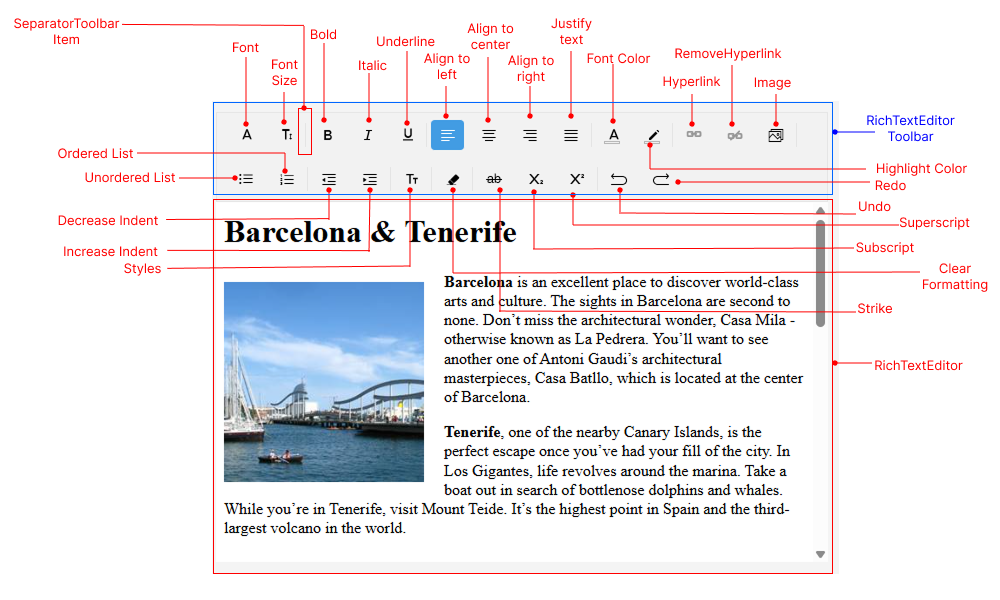

# .NET MAUI RichTextEditor Visual Structure

The visual structure of the .NET MAUI RichTextEditor represents the anatomy of the UI component. Being familiar with the visual elements of the RichTextEditor allows you to quickly find the information required to configure them.

The following image shows the anatomy of the RichTextEditor.

## Displayed Elements

* **RichTextEditor Toolbar**&mdash;The toolbar provides quick access to the most common formatting options, such as bold, italic, underline, font size, font color, and more. Each option is represented by an icon in the toolbar and visualized in the image.
* **RichTextEditor**&mdash;The control that allows users to create and edit rich text content with various formatting options.

## See Also

* [Getting Started]()
* [RichTextEditor Configuration]()
* [RichTextEditor Commands]()
* [RichTextEditor Events]()
* [RichTextEditor Custom Toolbar]()
