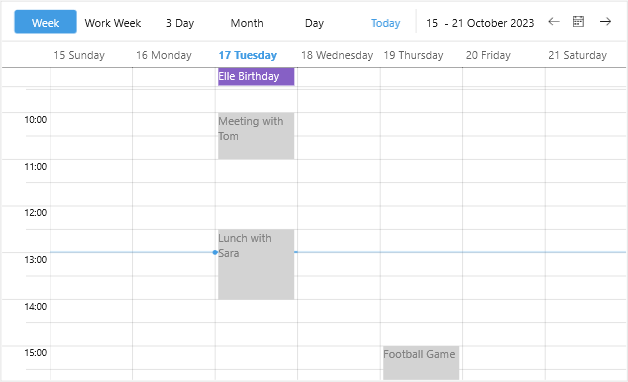

# Appointment Template

Scheduler for .NET MAUI provides the option to apply a `DataTemplate` to the Appointments for all the views. You can easily set a Template or TemplateSelector to the appointments through the `AppointmentTemplate` property:

* `AppointmentTemplate(DataTemplate)`&mdash;Defines the template of the appointments.

Here is a quick example how to apply a custom slot template to the Scheduler:

**1.** Create a custom `DataTemplateSelector` class:

```C#
public class CustomAppointmentDataTemplate : DataTemplateSelector
{
    public DataTemplate AllDayAppointmentTemplate { get; set; }
    public DataTemplate AppointmentTemplate { get; set; }

    protected override DataTemplate OnSelectTemplate(object item, BindableObject container)
    {
        var appointment = (item as AppointmentNode).Occurrence.Appointment;
        if (appointment.IsAllDay || (appointment.End - appointment.Start).TotalDays > 1)
        {
            return this.AllDayAppointmentTemplate;
        }

        return this.AppointmentTemplate;
    }
}
```

**2.** Add the template to the page resources:

<snippet id='scheduler-appointment-template-selector' />

**3.** Add the Scheduler definition with the `AppointmentTemplate` applied:

<snippet id='scheduler-appointment-template' />

Check the result below:



## See Also

- [Appointments]()
- [Views]()