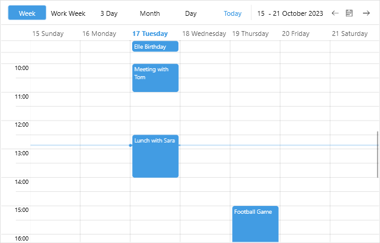

# Appointments 

Telerik UI for .NET MAUI Scheduler control allows you to display appointments by setting its `AppointmentsSource` property. `AppointmentsSource` accepts a collection of `Appointment` objects. Each `Appointment` defines the following properties:

* `Start`&mdash;Defines the value determining the start date and time of the аppointment.
* `End`&mdash;Defines the value that determining the end date and time of the appointment.
* `Subject`&mdash;Defines the value that indicates the subject of the appointment
* `IsAllDay`&mdash;Indicates whether the appointment will take all day.
* `RecurrenceRule`&mdash;Defines basic properties of the recurrence rule of the appointment, for more details go to [Recurrence]() topic.

Here is a quick example on how you can create Appointments collection and bind it to the `AppointmentsSource` property of `RadScheduler`.

**1.** First, create a ViewModel class and add "Appointments" collection inside it:

<snippet id='scheduler-appointments-viewmodel' />

**2.** Add the `RadScheduler` definition to the page:

<snippet id='scheduler-appointments-example' />

**3.** The last step is to set the ViewModel as a BindingContext:

<snippet id='scheduler-appointmentssource-setvm' />

The image below shows the appointments in WeekView:

## See Also

- [Appointment Template]()
- [Appointments Styling]()
- [Recurrence]()
- [Non-working hours]()