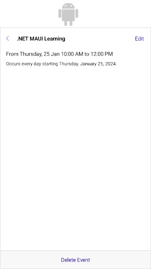
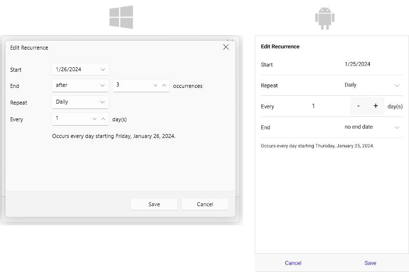
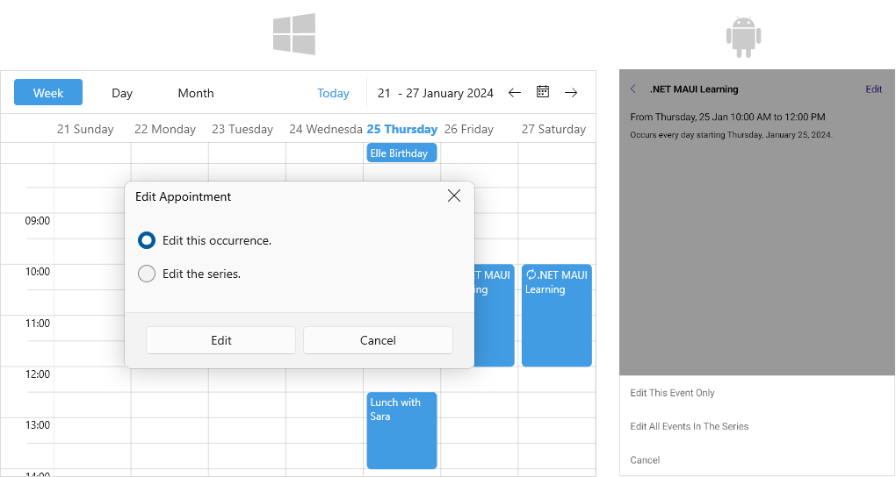
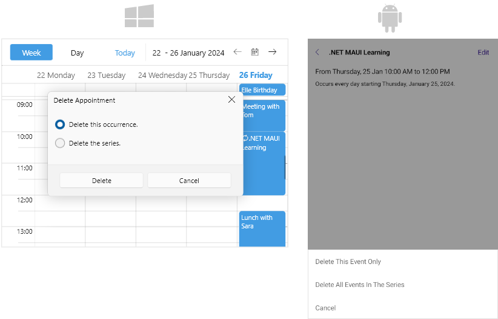
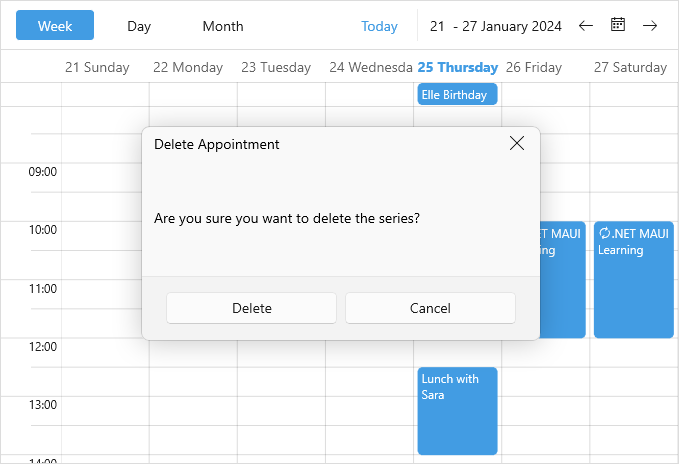

# .NET MAUI Scheduler Built-In Dialogs

Telerik .NET MAUI Scheduler control exposes built-in dialogs for creation and modification of appointments, so you can provide users with the ability to directly schedule their meetings.

Check below the available dialogs for managing appointments.

* **PreviewAppointment Dialog**&mdash;Used only on Android and iOS. When the end user taps on an existing appointment, the following dialog appears, giving the option to edit or delete the appointment:

* **EditAppointmentDialog**&mdash;Used for creating a new appointment or editing an existing appointment. 
    * On desktop the EditAppointment dialog appears when the end user double-clicks on an empty slot or an appointment. 
    * On mobile the EditAppointment dialog  appears when the end user taps on an empty slot to create a new appointment. For existing appointments EditAppointment dialog is navigated to from the PreviewAppointment dialog when tapping on the Edit button.

* **EditRecurrenceDialog**&mdash;Used for creating and editing the recurrence rule of a recurrent appointment.

* **EditRecurrenceChoiceDialog**&mdash;Provides the end user the option to edit single occurrence of an appointment or the whole series.

* **DeleteRecurrenceChoiceDialog**&mdash;Provides the end user the option to delete single occurrence of an appointment or the whole series.

* **DeleteAppointmentChoiceDialog**&mdash;Available only on desktop. Provides a confirmation for deleting an appointment.

### Methods

The Scheduler exposes a way to explicitly show the built-in dialogs through the following methods:

* `CreateAppointmentWithDialog(DataRange range)`&mdash;Opens a dialog for creating an appointment.
* `EditAppointmentWithDialog(Occurrence occurrence)`&mdash;Opens a dialog for editing an exsisting appointment.
* `DeleteAppointmentWithDialog(Occurrence occurrence)`&mdash;Opens a dialog for deleting an existing appointment.

Here is a quick example on how the methods for managing dialogs can be used:

**1.** Create a sample view with a `RadScheduler` instance and a few buttons:

<snippet id='scheduler-dialogs-methods-xaml' />

**2.** Add the buttons' clicked event handlers in the code-behind:

<snippet id='scheduler-dialogs-methods-eventhandlers' />

### Events

The Scheduler exposes the following events related to the built-in dialogs for managing appointments:

* `DialogOpening`&mdash;occurs when a dialog is about to be opened. The `DialogOpening` event handler receives two parameters:
    * The sender argument, which is of type `object`, but can be cast to the `RadScheduler` type.
    * A `SchedulerDialogOpeningEventArgs` object which you can use to get the dialog type through `DialogType` property as well as cancel the opening by setting its `Cancel` property to `True`.
* `DialogClosing`&mdash;occurs when a dialog is about to be closed. The `DialogClosing` event handler receives two parameters:
    * The sender argument, which is of type `object`, but can be cast to the `RadScheduler` type.
    * A `SchedulerDialogClosingEventArgs` object which you can use to get the dialog type through `DialogType` property as well as cancel the opening by setting its `Cancel` property to `True`. In addition, the `SchedulerDialogClosingEventArgs` provides a `DialogResult`(`bool?`) property which gives information on how the dialog is closed: `DialogResult` is null when the dialog is closed by the Close button of the dialog, `False` when Cancel option is pressed, otherwise the value is `True`.

Check a quick example on how the `DialogOpening` and `DialogClosing` events can be used:

**1.** Add the `RadScheduler` definition:

<snippet id='scheduler-dialogs-events-xaml' />

**2.** Add the event handlers:

<snippet id='scheduler-dialogs-events' />

### Customization

You can customize the visual appearance of each dialog by creating the corresponding style with TargetType set to `SchedulerDialog`. Here is a list of the available Style properties:

* `EditAppointmentDialogStyle`&mdash;Defines the Style that will be applied on the edit appointment dialog control.
* `EditRecurrenceDialogStyle`&mdash;Defines the Style that will be applied on the edit recurrence dialog control.
* `EditRecurrenceChoiceDialogStyle`&mdash;Defines the Style that will be applied on the edit recurrence choice dialog control.
* `DeleteAppointmentChoiceDialogStyle`&mdash;Defines the Style that will be applied on the delete appointment choice dialog control.
* `DeleteRecurrenceChoiceDialogStyle`&mdash;Defines the Style that will be applied on the delete recurrence choice dialog control.
* `PreviewAppointmentDialogStyle`&mdash;Defines the Style that will be applied on the preview appointment dialog control. This dialog is only used in Android and iOS. 

## See Also

- [Appointments]()
- [Recurrence Pattern](% slug recurrence-pattern %})
- [Recurrence Rule](% slug recurrence-rule %})
- [Views]()
