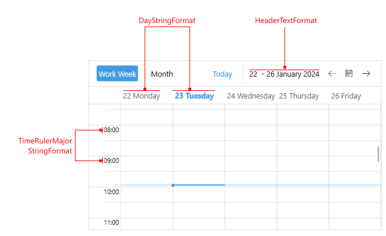
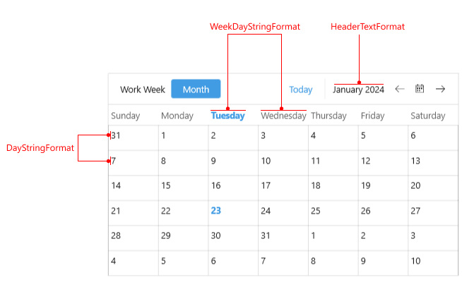
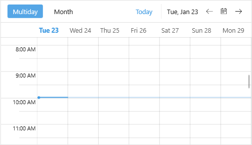

# .NET MAUI Scheduler Custom Date Formats

The Telerik UI for .NET MAUI Scheduler control provides built-in date formatting support. Each Scheduler view can be easily customized to display dates and times on the time ruler and in the headers in custom formats.

You can use the following date format properties for the different views:

### MultiDay View

* `HeaderTextFormat`&mdash;Defines the string format of the header text.
* `DayStringFormat`&mdash;Defines the string format of the header days.
* `TimeRulerMajorTickStringFormat`&mdash;Defines the string format of the major ticks.

### Month View

* `HeaderTextFormat`&mdash;Defines the string format of the header text.
* `DayStringFormat`&mdash;Defines the string format of the header days.
* `WeekDayStringFormat`&mdash;Defines the string format of the week day dates.

### Example

Check a quick example on how to apply custom date formats to the Scheduler views:

<snippet id='scheduler-custom-date-formats' />

And here is he result:

## See Also

- [Visual Structure]() 
- [Views]()