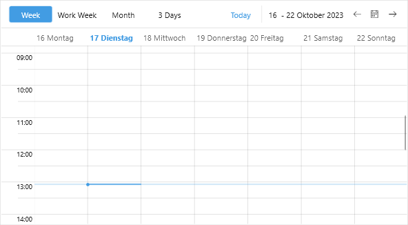

# .NET MAUI Scheduler Globalization

Globalization refers to developing an application in such a way that it works on the target device culture. This includes changes in the Calendar day names and first day of week.

The Telerik UI for .NET MAUI Scheduler control supports globalization through the `Culture` property (of type `System.Globalization.CultureInfo`). 

The following example demonstrates how to set the desired culture in the Scheduler.

Here is the `RadScheduler` definition:

<snippet id='scheduler-globalization' />

Set the `Culture` property to the `RadScheduler` instance:

<snippet id='scheduler-culture-set' />

Here is the result:

## See Also

- [Localization in .NET MAUI Scheduler]()
