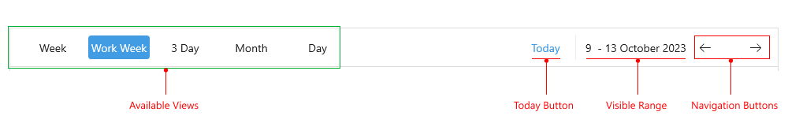
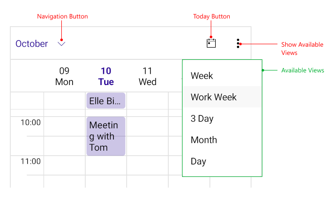

# .NET MAUI Scheduler Header Visual Structure

 Scheduler for .NET MAUI provides a header which can be used to quickly switch between the available views as well as navigate to a different date. In additon, the header includes an optional Today button for navigating directly to Today date.

The following image shows the anatomy of the Scheduler Header on desktop and mobile.

### Visual Structure on Desktop

### Visual Structure on mobile

## Displayed Elements

* **Navigation Buttons**&mdash;Used to navigate to previous/next dates according to the view, available only on desktop, as on mobile the view is navigated through gestures.
* **Today Button**&mdash;Directly navigates the view to Today date.
* **Available Views**&mdash;List of the views the user can choose from. On desktop the list is always visible in the header, while on mobile users would need to tap on the options button to see it.
* **Visible Range**&mdash;Shows the current visible range which depends on the selected view.

## See Also

- [Telerik .NET MAUI Blogs](https://www.telerik.com/blogs/mobile-net-maui)
- [Telerik .NET MAUI Roadmap](https://www.telerik.com/support/whats-new/maui-ui/roadmap)