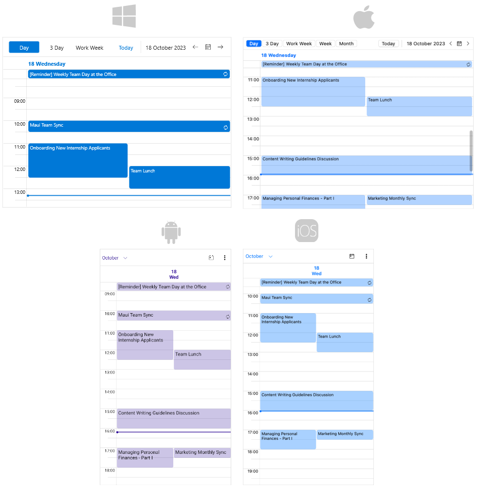

# .NET MAUI Scheduler Overview

The Telerik UI for .NET MAUI Scheduler allows you to easily implement various scheduling scenarios in your .NET MAUI apps. Scheduler offers highly customizable built-in views - you can adjust the current time, visible hours and dates, time ruler, special time slots, and more. In addition, you have full control over the way appointments are visualized in the views.

## Key Features

* [Built-in Views]()&mdash;The Scheduler control comes with a few customizable predefined views: month, week, multiday and day views.
* [Appointments]()&mdash;Through the `AppointmentsSource` property you can populate the Scheduler with appointments. In addition, you can define a custom template as well as apply various styling options to the appointments to achieve the desired look & feel.
* [Recurrent Appointments]()&mdash;The control provides the functionality to configure repeating appointments. You can apply recurring scheduling patterns such as daily, weekly, monthly or set a range of recurrence from date to date to the appointments.
* Current Date&mdash;Defines the currently visible date. Depending on the active view, `CurrentDate` specifies which days, week or month are visualized.
* [Current Time Indicator]()&mdash;Scheduler control displays a specific indicator that highlights the current time over the view.
* [Header]()&mdash;The control provides a header which shows the current visible range, optional Today button as well as lists the available views.
* [Programmatic Scrolling]()&mdash;Through the `ScrollIntoView` method you can adjust the current view in such a way it is directly scrolled to concrete time.
* Time Ruler&mdash;Time Ruler is used to indicate the time intervals across the views. You can easily modify the density and the size of the time ruler ticks through various configuration properties.
* [Special Slots]() &mdash;You have the option to define a collection of customizable time slots in order to make them noticeable across the view.  
* Non-Working Hours&mdash;Easily apply non-working time to the Scheduler views by creating read-only special slots for the corresponding time.
* [Globalization]()&mdash;The Telerik UI for .NET MAUI Scheduler control supports globalization and allows you to adjust its culture through the `Culture` property.
* [Localization]()&mdash;Translate the phrases used across the Scheduler control to other languages so that you can adapt your app to different regions.
* [Commands]()&mdash;The Telerik UI for .NET MAUI Scheduler exposes a number of commands that will be executed upon various user actions, such as navigate to previous/next dates, tap on an appointment or empty slot, and more.
* Flexible Styling API&mdash;Thanks to the control’s flexible API you can directly configure how various elements of the Telerik UI for .NET MAUI Scheduler are displayed in your application, change the time ruler, the cell appearance and how appointments look.

## Next Steps

- [Getting Started with Telerik UI for .NET MAUI Scheduler]()

## See Also

- [Telerik .NET MAUI Blogs](https://www.telerik.com/forums/maui?tagId=2058)
- [Telerik .NET MAUI Roadmap](https://www.telerik.com/support/whats-new/maui-ui/roadmap)