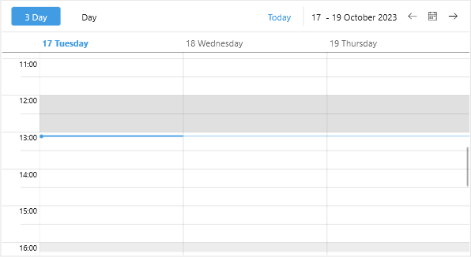

# Special Slots

The Telerik UI for .NET MAUI Scheduler control exposes an option to define the special and read-only slots and apply different styles to them. You need to prepare a collection of `Slot` objects and assign it to the `SpecialSlotsSource` property of the corresponding view definition.

Every `Slot` has the following properties:

* `Start`(`DateTime`)&mdash;Defines the start date of the slot.
* `End`(`DateTime`)&mdash;Defines the end date of the slot.
* `ReccurencePattern`(`RecurrencePattern`)&mdash;Defines whether the slot will be displayed for repeating days.
* `IsReadOnly`(`bool`)&mdash;When set to `True` the slot is disabled.
* `TimeZone`(`TimeZoneInfo`)&mdash;Specifies the slot time zone. 

Below you can find a quick example how to create special slots.

**1.** First, create a ViewModel class with a collection of `Slot` objects. In the example two repeating slots are added for rest hours during weekdays. 

<snippet id='scheduler-specialslots-viewmodel' />

**2.** Then, add `RadScheduler` definition with some sample views with `SpecialSource` property applied:

<snippet id='scheduler-special-slots' />

**3.** Last step is to set the BindingContext to the ViewModel class:

<snippet id='scheduler-specialslots-setvm' /> 

Check in the image below how the special slots look in MultiDay View:

# See Also

- [Special Slots Template]()
- [Views]()
- [Non-working hours]()
