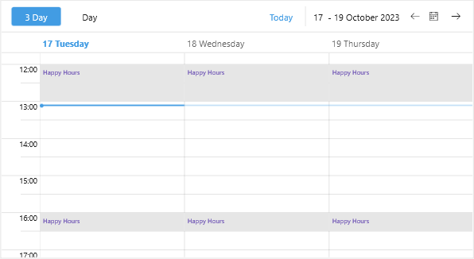

# SpecialSlot Template

By default the special slots are marked with a different background, so that they are easily noticable across the view. In addition you can show a content of your choice inside special slots through the `SpecialSlotTemplate` property of the view definitions.

* `SpecialSlotTemplate(DataTemplate)`&mdash;Defines the template of the special slots.

Here is a quick example how to apply a custom slot template to the Scheduler:

**1.** Add the template to the page resources:

<snippet id='scheduler-customslots-resources' />

**2.** Add the Scheduler definition with the `SpecialSlotTemplate` applied:

<snippet id='scheduler-special-slots-template' />

Check the image below which shows the applied `SpecialSlotTemplate`:

## See Also

- [Special Slots]()
- [Views]()