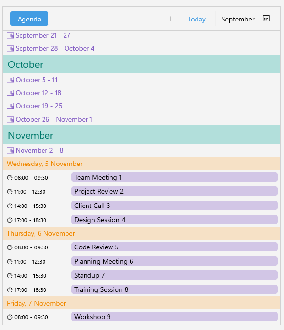

# .NET MAUI Scheduler Agenda Styling

Use the following properties of the `AgendaViewDefinition` to customize the appearance of the agenda view:

* `MonthTemplate` (`DataTemplate`)&mdash;Specifies the template used to display month headers in the agenda view.
* `WeekTemplate` (`DataTemplate`)&mdash;Specifies the template used to display week headers in the agenda view.
* `DayTemplate` (`DataTemplate`)&mdash;Specifies the template used to display day headers in the agenda view.
* `AppointmentDurationTemplate` (`DataTemplate`)&mdash;Specifies the template used to display appointment duration in the agenda view.
* `InitializationBusyIndicatorStyle` (`Style` with target type `RadBusyIndicator`)&mdash;Specifies the style for the busy indicator shown during initial data loading. This indicator appears centered on screen while the agenda items are being loaded and until scroll is performed to the current item.
* `LoadingProgressIndicatorStyle` (`Style` with target type `RadLinearProgressBar`)&mdash;Specifies the style applied to the progress bar displayed when loading appointments for the visible range.

Here is an example of how to define custom templates in the Agenda View:

1. Define the Agenda View in XAML:

<snippet id='scheduler-agendaview-templates'/>

2. Add the templates to the page's resources:

<snippet id='scheduler-agenda-templates'/>

3. Add the `telerik` namespace:

```XAML
xmlns:telerik="http://schemas.telerik.com/2022/xaml/maui"
```

4. Add a `ViewModel` for the `AppointmentSource`:

<snippet id='agenda-view-viewmodel'/>

This is the result on WinUI:



## See Also

- [Views]()
