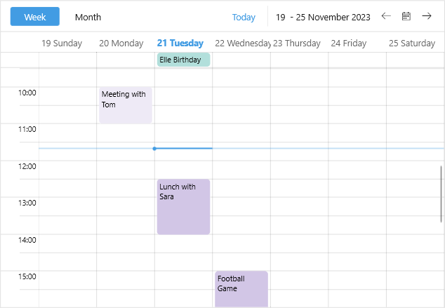

# .NET MAUI Scheduler Appointments Styling

The Scheduler for .NET MAUI control makes it easy to customize the look & feel of the appointments.

Scheduler exposes an `AppointmentStyleSelector` (type `Telerik.Maui.Controls.IStyleSelector`) property which conditionally applies different appointment styles depending on some logic.

In the example below the custom `AppointmentStyleSelector` applies separate style to past and future appointments.

**1.** Create a custom Style Selector class:

<snippet id='scheduler-customappointmentstyleselector' />

**2.** Add the style selector with the corresponding styles to the page resources:

<snippet id='scheduler-appointments-styleselector' />

**3.** Define the Scheduler with the `AppointmentStyleSelector` applied:

<snippet id='scheduler-appointments-styling' />

Check the result on Windows below:

## See Also

- [Appointments]()
- [Appointment Template]()