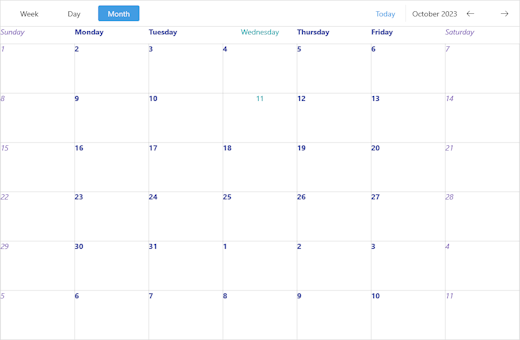

# .NET MAUI Scheduler Day Styling

The Scheduler control for .NET MAUI provides the `DayStyleSelector`(of type `Telerik.Maui.Controls.IStyleSelector`) property which specifies the style selector for the days displayed in the Scheduler. Its default implementation includes separate styles for Today date and all the other dates.

The following example demonstrates how to style the days with a custom `DayStyleSelector` property which will add a different style for the days of the weekend:

**1.** Add a `CustomStyleSelector` class that inherits from `Telerik.Maui.Controls.Scheduler.DayStyleSelector`:

<snippet id='scheduler-customdaystyleselector'/>

**2.** Add the style selector to the page's resources:

<snippet id='scheduler-customdaystyleselector-xaml'/>

**3.** Define the Scheduler:

<snippet id='scheduler-day-styling'/>

## See Also

-[Views]()
