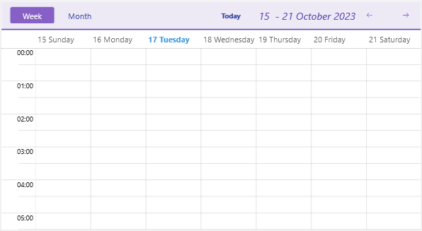

# .NET MAUI Scheduler Header Styling

The .NET MAUI Scheduler component comes with built-in styling options that allow you to customize the appearance of its header.

You can style separately the header border, header labels, navigation buttons and more. Here is a list of the available header style properties of the Scheduler:

* **HeaderBorderStyle**&mdash;Applies styles such as border thickness and color to the header.
* **HeaderLabelStyle**&mdash;Applies styles such as TextColor, FontSize, etc to the label displaying the visible range in the header.
* **IncreaseVisibleRangeButtonStyle** and **DecreaseVisibleRangeButtonStyle**&mdash;Apply styles to the buttons used for navigating the view (only desktop).
* **TodayButtonStyle**&mdash;Defines style for the Today button.
* **HeaderIndicatorLabelStyle**&mdash;Sets style to the label used for showing the popup for date selection (mobile only).
* **ViewDefinitionHeaderItemStyle** and **ActiveViewDefinitionHeaderItemStyle**&mdash;Apply styles to the available views and active view headers.

The following example demonstrates how to apply custom header styles to the Scheduler:

**1.** Define the Scheduler:

<snippet id='scheduler-header-styling-definition'/>

**2.** Add the custom styles to the page's resources:

<snippet id='scheduler-header-styles'/>

## See Also

-[Header Visual Structure]()