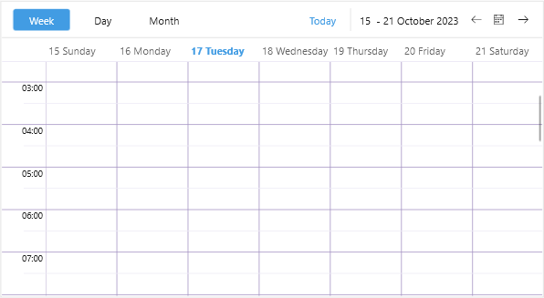

# .NET MAUI Scheduler Lines Styling

The Scheduler for .NET MAUI provides styling options for the lines across the views.

For the day views (Day, Week and Multiday views) you can style the lines defined by their `MinorTickLength` and `MajorTickLength`, and for all the views you can style horizontal and vertical lines which divide different parts of the control. 

Here is a list of the available styling properties you can apply to the corresponding views:

* `MajorTickLineStyle`&mdash;Applies style to the line defined by the time ruler major tick; available for Day, Week and Multiday views.
* `MinorTickLineStyle`&mdash;Applies style to the line defined by the time ruler minor tick; available for Day, Week and Multiday views.
* `VerticalLineStyle`&mdash;Applies style to the vertical lines across the views, for example the line that divides the week days in week view.
* `HorizontalLineStyle`&mdash;Applies style to the horizontal lines across the views, for example the line between the week days and the appointments view area in WeekView, or the horizontal lines between the weeks in month view.

Here is a quick example on how the listed properties can be used:

**1.** Define the Scheduler:

<snippet id='scheduler-lines-styling-definition'/>

**2.** Add the custom styles to the page's resources:

<snippet id='scheduler-lines-styles'/>

Here is the result:

## See Also

- [Time Ruler]()
- [Views]()
- [Day Styling]()