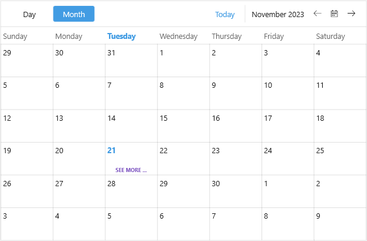

# .NET MAUI Scheduler More Appointments Indicator Styling

The Scheduler Month View displays appointments for one month and allows users to browse through longer-term periods. The space for appointments on a particular day is limited, and if there are more appointments on that day, a more appointments indicator appears to notify the users that not all appointments are shown.

You can customize the more appointments indicator through `DayMoreAppointmentsIndicatorStyle` property of the MonthViewDefinition.  

The following example demonstrates how to apply a sample style to the`DayMoreAppointmentsIndicatorStyle`:

**1.** Add a custom Style with `TargetType` set to `Label` to the page's resources:

<snippet id='scheduler-moreindicator-style'/>

**2.** Define the Scheduler with a `MonthViewDefinition` with the `DayMoreAppointmentsIndicatorStyle` applied:

<snippet id='scheduler-moreindicatorstyling-definition'/>

## See Also

-[Views]()
-[Month View]()
