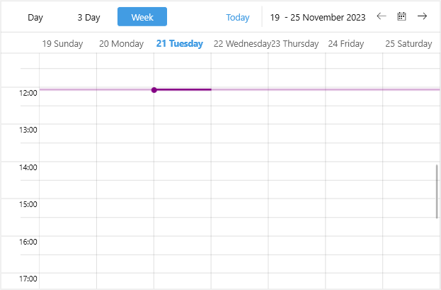

# .NET MAUI Scheduler Current Time Indicator Styling

The Scheduler control provides current time indicator which visually marks the current time in the time ruler and across the appointments area.

You can customize the current time indicator by creating a Style property with TargetType set to `SchedulerCurrentTimeIndicator`.  

The following example demonstrates how to apply a sample style to the current time indicator:

**1.** Add a custom Style with TargetType set to `SchedulerCurrentTimeIndicator` to the page's resources:

<snippet id='scheduler-currenttimeindicator-styling'/>

**.2** Define the Scheduler:

<snippet id='scheduler-currenttimeindicator-styling-definition'/>

## See Also

-[Current Time Indicator]()
-[Views]()

