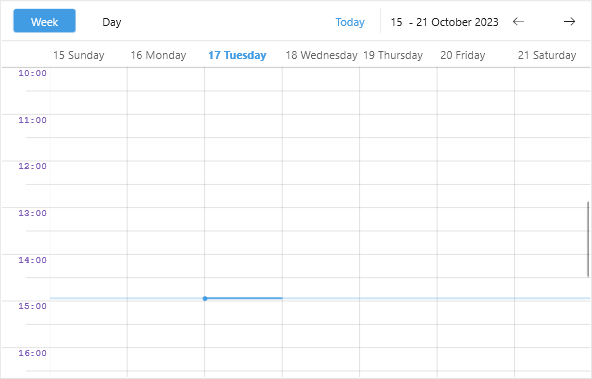

# .NET MAUI Scheduler TimeRuler Labels Styling

The Scheduler for .NET MAUI provides style property for the labels displayed on the major tick in the time ruler of the day views (Day, Week and MultiDay views).

Through the `TimeRulerLabelStyle` property of the corresponding `ViewDefinition` (Day, Week or MultiDay) you can apply style to the Label controls shown on the major ticks in the time ruler.

Here is a quick example on how `TimeRulerLabelStyle` property can be used:

**1.** Define the Scheduler:

<snippet id='scheduler-timerulerlabelsstyling-definition'/>

**2.** Add the custom styles to the page's resources:

<snippet id='scheduler-timerulerlabels-style'/>

Check the result below:

## See Also

- [Time Ruler]()
- [Views]()
- [Lines Styling]()