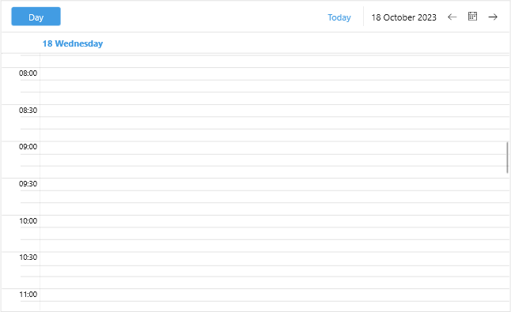

# .NET MAUI Scheduler Time Ruler 

Time Ruler represents the time axis inside the Scheduler day views (day, week and multiday views). 

DayView, WeekView and MultiDayView expose some properties to determine the density of the time ruler items as well as the time ruler size:

* `MinorTickLength(TimeSpan)`&mdash;Defines the length of the minor ticks.
* `MajorTickLength(TimeSpan)`&mdash;Defines the length of the major ticks.
* `MinTimeRulerExtent(double)`&mdash;Defines the minimum size of the time ruler in pixels.
* `MaxTimeRulerExtent(double)`&mdash;Defines the maximum size of the time ruler in pixels.

Check a quick example on how `MinorTickLength`, `MajorTickLength` and `MinTimeRulerExtent` can be applied to DayView:

```XAML
<telerik:RadScheduler x:Name="scheduler">
    <telerik:RadScheduler.ViewDefinitions>
        <telerik:DayViewDefinition MinorTickLength="00:10"
                                   MajorTickLength="00:30" 
                                   MinTimeRulerExtent="2800"/>
    </telerik:RadScheduler.ViewDefinitions>
</telerik:RadScheduler>
```



## See Also

- [Visual Structure]() 
- [Views]()
