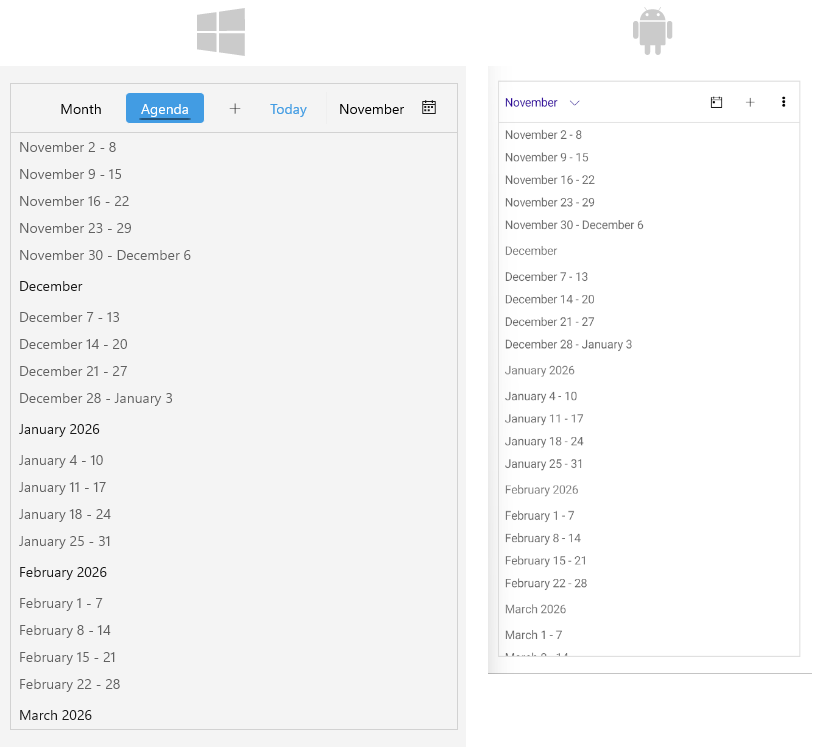

# Agenda View

The Agenda View represents a view that shows a list of appointments in a continuous, scrollable format.

## Set the Agenda View

Add a `AgendaViewDefinition` to the `ViewDefinitions` collection of the `RadScheduler` instance.

```XAML
<telerik:RadScheduler x:Name="scheduler">
    <telerik:RadScheduler.ViewDefinitions>
        <telerik:AgendaViewDefinition />
    </telerik:RadScheduler.ViewDefinitions>
</telerik:RadScheduler>
```



## Properties on Scheduler Level

* `AddAppointmentCommand` (`ICommand`)&mdash;Defines the command that is executed when the add appointment button is clicked. This command opens the appointment creation dialog.
* `AddAppointmentButtonStyle` (`Style` with target type `RadButton`)&mdash;Defines the style that is applied to the add appointment button displayed in the Scheduler header. The button is visible for the `Agenda` view.

## Properties on Agenda View Level

* `Title` (`string`)&mdash;Specifies the name for the view. If not explicitly set, a default title may be generated.
* `HeaderTextFormat` (`string`)&mdash;Defines the string format of the header text.
* `FirstDayOfWeek` (`DayOfWeek?`)&mdash;Defines the day that is considered the beginning of the week.
* `MonthTemplate` (`DataTemplate`)&mdash;Specifies the template used to display month headers in the agenda view.
* `WeekTemplate` (`DataTemplate`)&mdash;Specifies the template used to display week headers in the agenda view.
* `DayTemplate` (`DataTemplate`)&mdash;Specifies the template used to display day headers in the agenda view.
* `AppointmentDurationTemplate` (`DataTemplate`)&mdash;Specifies the template used to display appointment duration in the agenda view.
* `InitializationBusyIndicatorStyle` (`Style` with target type `RadBusyIndicator`)&mdash;Specifies the style for the busy indicator shown during initial data loading. This indicator appears centered on screen while the agenda items are being loaded and until scroll is performed to the current item.
* `LoadingProgressIndicatorStyle` (`Style` with target type `RadLinearProgressBar`)&mdash;Specifies the style applied to the progress bar displayed when loading appointments for the visible range.

## See Also

- [Views]()
- [Multiday View]()
- [Week View]()
- [Custom Date Formats]()