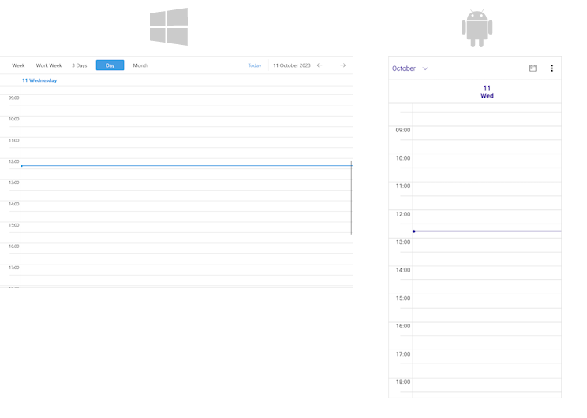

# Day View 

The Day View represents a view that shows a single day.

## Set the Day View 

Add a `DayViewDefinition` to the `ViewDefinitions` collection of the `RadScheduler` instance.

```XAML
<telerik:RadScheduler AutomationId="scheduler">
    <telerik:RadScheduler.ViewDefinitions>
        <telerik:DayViewDefinition />
    </telerik:RadScheduler.ViewDefinitions>
</telerik:RadScheduler>
```



## Properties

* `DayStartTime`&mdash;Defines the time used to indicate the start of the day.
* `DayEndTime`&mdash;Defines the time used to indicate the end of the day.
* `IsCurrentTimeIndicatorVisible`&mdash;Defines the value indicating whether the current time indicator is visible. For more details on this go to [Current Time Indicator]() topic.
* `MajorTickLength`&mdash;Defines the length of the major ticks.
* `MinorTickLength`&mdash;Defines the length of the minor ticks.
* `MinTimeRulerExtent`&mdash;Defines the minimum size of the time ruler in pixels.
* `MaxTimeRulerExtent`&mdash;Defines the maximum size of the time ruler in pixels.

## See Also

- [Views]()
- [Multiday View]()
- [Week View]()