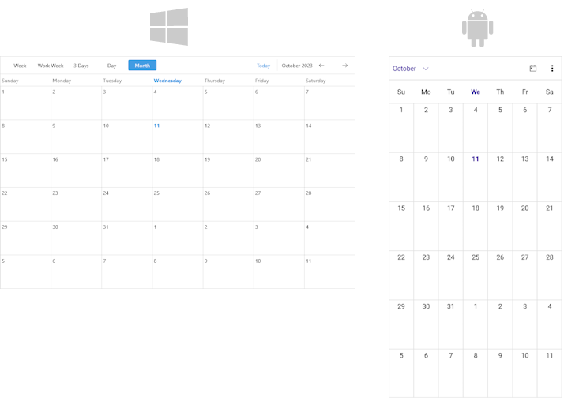

# Month View 

The Month View displays appointments in one month and allows users to browse through long-term periods. It is always grouped by week.

## Set the Month View

Add a `MonthViewDefinition` to the `ViewDefinitions` collection of the `RadScheduler` instance.

```XAML
<telerik:RadScheduler x:Name="scheduler">
    <telerik:RadScheduler.ViewDefinitions>
        <telerik:MonthViewDefinition />
    </telerik:RadScheduler.ViewDefinitions>
</telerik:RadScheduler>
```



## Properties

* `FirstDayOfWeek`&mdash;Defines the day that is considered the beginning of the week.
* `HeaderTextFormat`&mdash;Defines the format string for the header text. 

## See Also

- [Views]()
- [Day View]()
- [Multiday View]()
- [Week View]()