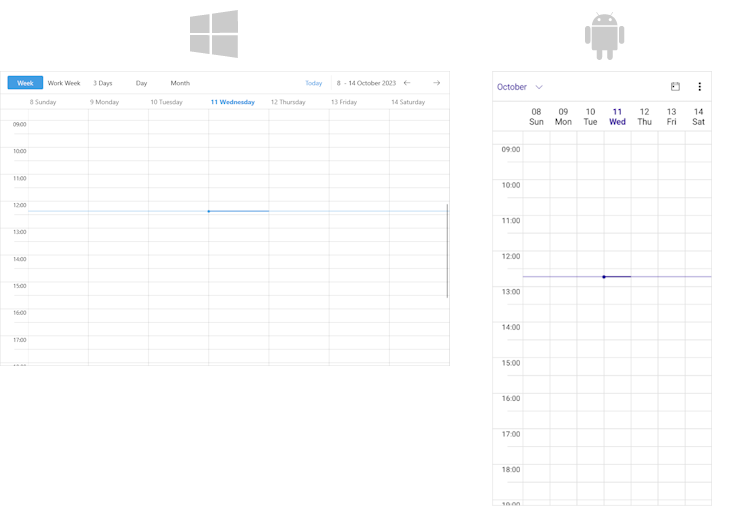

# Week View 

The Week View represents a view that shows all days of the week defined by the `CurrentDate`. The Week View contains the same properties as the Day View with the only difference that the displayed period is not just a single day but the days of a whole week. 

In addition, you can decide whether to show the weekend, or only the work days through the `IsWeekendVisible` property of the Week View.

## Set the Week View

Add a `WeekViewDefinition` to the `ViewDefinitions` collection of the `RadScheduler` instance.

```XAML
<telerik:RadScheduler x:Name="scheduler">
    <telerik:RadScheduler.ViewDefinitions>
        <telerik:WeekViewDefinition />
    </telerik:RadScheduler.ViewDefinitions>
</telerik:RadScheduler>
```



## Properties

* `DayStartTime`&mdash;Defines the time used to indicate the start of the day.
* `DayEndTime`&mdash;Defines the time used to indicate the end of the day.
* `IsWeekendVisible`&mdash;Indicates whether the weekend days are visible, so that only the work week is displayed.
* `IsCurrentTimeIndicatorVisible`&mdash;Defines the value indicating whether the current time indicator is visible.
* `MajorTickLength`&mdash;Defines the length of the major ticks.
* `MinorTickLength`&mdash;Defines the length of the minor ticks.
* `MinTimeRulerExtent`&mdash;Defines the minimum size of the time ruler in pixels.

## See Also

- [Views]()
- [Day View]()
- [Multiday View]()
- [Current Time Indicator]()
